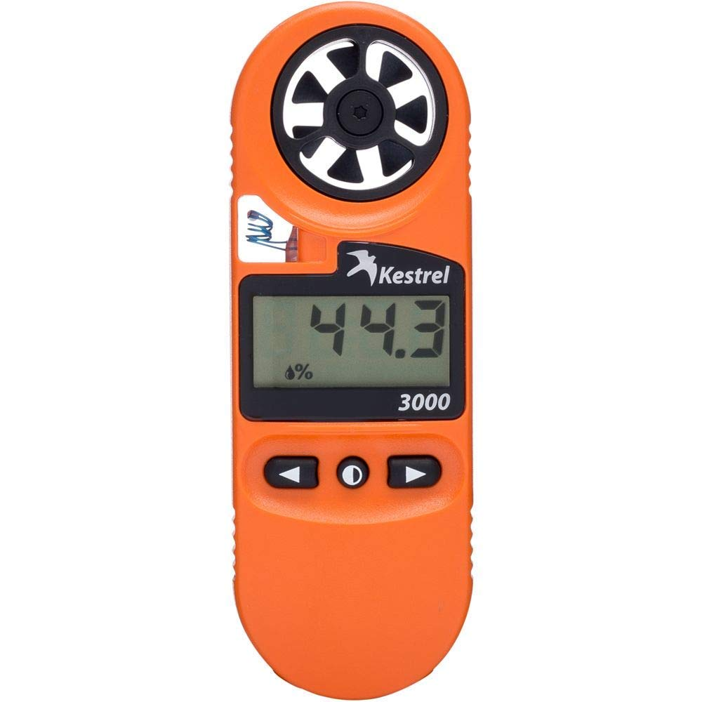

[< Back to home](./index.md)

# Appendix B: User Needs, Benchmarking, and Requirements
## Additional content from User Needs, Benchmarking, and Requirements

### VoC Benchmarking

**Product 1: [Multifunctional Pro Digital Anemometer](https://www.amazon.com/Handheld-Anemometer-Measures-Humidity-Temperature/dp/B09H359ZYZ/ref=sr_1_14?keywords=handheld+weather+station&qid=1673918266&sr=8-14)**

| Price  	| Vendor 	    | Search Keywords         |
|---------	|--------------	|-------------------------|
| $46.99   	| Amazon        | Handheld Weather Station|

> Description: It can measure wind speed, air volume, wind temperature, wind humidity, dew point temperature, wet bulb temperature. Can be widely used in wind energy, meteorology, industry, agriculture, hydrology and water conservancy, environmental protection, highways, airports, etc. Low friction bearing technology, 8 blades, wider blade diameter, more accurate measurement and more sensitive response, giving you a great using experience.  

**Positive Reviews**

| Voice of the Customer  	| Restated Customer Need |
|---------	|--------------	|
| “I enjoy building and flying model airplanes, and excessive wind can be a problem, especially for lighter models. A flying buddy brought a simple handheld anemometer to our field, and we found it useful to evaluate flying conditions, and to determine how much wind was too much for a particular model."  	| Device is simple to operate        |
|  | Readings are consistent and accurate (explicit) |
|  | Device has multiple functionalities (explicit) |
| “This wind meter is packed with features, and you can easily switch between different units of measure. I’ll be using this for several applications; out kayaking to know when it is safe, on the range to compensate for long range shots, and to determine if conditions are good enough to fly a drone." | Device has many functionalities. (explicit)|
|  | Size of device is compact, making it easy to carry. (explicit) |
|  | Readings from device are made easier to see with backlit display; use at night, dark places and bright areas are possible. (latent) |
| "I do all the maintenance and work on my home heat pump system, and I needed a way to check my system's airflow. My air handler is just in a closet with no duct work on the return, so measuring static pressure with pitot tubes is not feasible. I got this to get some idea of the total airflow of the system, and I can also use it to check each vent to make sure everything is running smoothly. You can specify the approximate area of your return or duct and it will calculate the CFM for you, unlike most of the cheap anemometers available." | Device offers a feature that more affordable alternatives do not offer (explicit) |
|  | Device offers a means to digitally graph readings through provided software. (explicit) |
|  | Use of device in the context of air vents is possible through the backlit screen the device has. (latent) |

**Negative Reviews**

| Voice of the Customer  	| Restated Customer Need |
|---------	|--------------	|
| "“The wind meter works as expected, but the old connector, display, build quality and use of AAA batteries makes it feel cheap." | The device needs good quality material for its build. (explicit) |
|  | The physical build of the device needs to utilize the inner space as efficiently as possible and minimizes empty space inside. (latent) |
|  | Power system of device needs to be up-to-date and interchangeable between batteries and other possible ways to power it. (latent) |
| "It does not come with batteries and that the units reset every time you power it off. It's the work of seconds to get it back to knots or miles per hour or whatever, but it would be nice if it remembered my settings from use to use." | Batteries ought to be provided for device or maybe include rechargeable batteries for the power system. (latent) |
|  | User input for settings ought to be saved upon power down for ease of use. (explicit) |
|  | Simpler ways to switch units for readings are worth looking into. (latent) |
| "I got it to play with and had in mind that I would use it to supplement my weather station to track my weather. But because does not appear to remember reading when not connected to a computer, and since it turns off after 10min (this is good feature, just not for my intended purpose) this will remain in my tool library to be used when needed and not an every day item.” | Device could benefit from having the ability to calibrate it. (explicit) |
|  | Device electronics should be protected from moisture as much as possible. (explicit) |
|  | Auto-shutoff features should be configurable within the device. (latent) |

**Product 2: [Kestrel 3000 Pocket Weather Meter / Heat Stress Monitor](https://www.amazon.com/Kestrel-Pocket-Weather-Stress-Monitor/dp/B017AEZXBO/ref=sr_1_12?keywords=handheld+weather+station&qid=1673918266&sr=8-12&ufe=app_do%3Aamzn1.fos.f5122f16-c3e8-4386-bf32-63e904010ad0)**

| Price  	| Vendor 	    | Search Keywords         |
|---------	|--------------	|-------------------------|
| $159   	| Amazon        | Handheld Weather Station|

> Description: Description: Accurate, rugged handheld weather and heat index meter with large, replaceable impeller, responsive temperature sensor and temperature-corrected humidity chamber. Measures heat stress index, relative humidity, dew point temperature, wind chill, air/water/snow temperature, current/average/maximum wind speeds on large, clear LCD. Waterproof (IP-67), floats, drop-tested to military standards (MIL-STD-810G), patented.

**Positive Reviews**

| Voice of the Customer  	| Restated Customer Need |
|---------	|--------------	|
| “This is exactly what we were looking for! Easy to use - you do not need to be a technician to operate it! Lightweight - nice display. Perfect what our camping and traveling needs. And the protective shield that it comes with is great!” | Device is simple to operate. (explicit) |
|  | Compact and lightweight features of the device improve ease of use. (explicit) |
|  | Device comes with a protective sleeve for improved preservation (explicit) |
| “It is portable, has a sturdy case, and is pretty accurate for such a small unit.” | Ease of use is improved through portability due to its compact design. (explicit) |
|  | Accuracy of readings are up to par. (explicit)  |
|  | Provided case for the device is durable. (explicit) |
| “Purchased for work but used at home for spot weather. Directions are easy to follow. Extremely accurate readings. Made to last.” | Directions for operation of the device are easy to follow. (explicit) |
|  | Accuracy of readings are up to par. (explicit) |
|  | Build of the device is durable for its intended purpose. (explicit) |

**Negative Reviews**

| Voice of the Customer  	| Restated Customer Need |
|---------	|--------------	|
| “Lost my company supplied one within my first week of work and was not trusted with another so had to get my own. And I mean, now I have my own personal kestrel but its expensive so don't lose it if your company supplies you with only one. Works well, though if holding two side by side I've found that they may show different readings which can be a pain for pesticide application when you are either just over or just under a legal limit factor.” | Device should be affordable. (latent) |
|  | Readings of device should be precise, consistent, and steady enough to prevent confusion when readings reach a desired limit. (explicit) |
|  | Device should employ a method to clip or attach it to something for carrying purposes to reduce likelihood of losing it. (latent) |
|  | Device should have a way to calibrate it to compare and contrast with other alternatives. (latent) |
| “I use this for monitoring heat stress levels at work and it works great and is very reliable. It's quite sensitive even to body heat/humidity so make sure you're holding it as far away from you as you can. Easy to use.” | Device should have safeguards in place to prevent picking up noise from readings while in use. (explicit) |
|  | Device should have a way to attach it to another surface or prop to minimize noisy readings. (latent) |
|  | Device could benefit from having a zero-ing feature to minimize noisy readings from using it in close proximity. (latent) |
| “Used these for years and continue to be reliable and accurate. Great product except no warning on Customs charges to ship to Canada. Be prepared to pay additional $70 or more. Customs charges should be included like other sellers on amazon. Contacted Seller but no response. Disappointed in the surprised additional cost.” | Device should be affordable, in terms of construction and delivery. (explicit) |
|  | Device should be as readily available to the public as possible. (latent) |
|  | Choice of materials for device should make sense to maximize availability for consumer. (latent) |

**Product 3: [Weather Station with Atomic Clock](https://www.amazon.com/Thermometer-Wireless-Temperature-Humidity-Barometer/dp/B0B981H9Y8/ref=sr_1_37?keywords=handheld+weather+station&qid=1673918266&sr=8-37)**

| Price  	| Vendor 	    | Search Keywords         |
|---------	|--------------	|-------------------------|
| $37.99   	| Amazon        | Handheld Weather Station|

> Description: This Weather Station senses and reports the indoor and outdoor temperature, humidity, and barometric pressure. It can connect up to 3 sensors, with a maximum distance of 300 feet. 

**Positive Reviews**

| Voice of the Customer  	| Restated Customer Need |
|---------	|--------------	|
| The thermometers and hygrometers on the base station and remote sensor seem to be accurate. | The device must sense the environment. (explicit) |
|  | The device must display the information it collects. (explicit) |
|  | The product must provide accurate information. (explicit)  |
| “Initially the screen will intermittently go dark for 7 to 10 minutes after first set up while trying to connect with the atomic clock. At first I thought the unit was defective but figured this out after rereading the instructions in the atomic clock section.” | The product’s documentation must be clear enough to understand the first time. (latent) |
|  | The product must behave in an intuitive, easy-to-understand way. (latent) |
|  | The product must indicate its current state to the user. (latent) |
| "It's bright and easy to read and I love that I can see the weather and the indoor and outdoor temps so easily, without opening up my phone.” | The device must be easy to use. (Explicit) |
|  | The product must have a clear user interface. (latent) |

**Negative Reviews**

| Voice of the Customer  	| Restated Customer Need |
|---------	|--------------	|
| “The screen has no 'on' or 'off' button; just the settings buttons, so I've toggled them to turn it on. It only stays on for but a moment which means you have to keep toggling while you're reading it.”| The product must include basic features of an electronic device that all users will expect. (Explicit) |
|  | The product must not attempt to prevent the user from using it for their desired purpose. (latent) |
| “Erratic in displaying outside temperature and time. It appears to be searching for a signal though outdoor sensor is only twenty feet away and all with good batteries. So, I unplug and take batteries out and set up again and it starts working again only to stop after a few days and have to do it all over again. Clock has changed time zones out of the blue too.” | The product must be reliable. (Explicit) |
|  | The product must act in a consistent manner. (latent) |
|  | The product must not incorporate features which the user has to ‘work around’ to do what they want. (Latent) |
| “The other thing that's an issue is batteries. If you want three sensors plus the hub battery powered, that's nine total (two for each sensor, three for the display). It seems like a lot for something like this, but if they last a long time it may not be an issue.” | The product must be low-power. (latent) |
|  | The product must run for a long time without maintenance. (latent) |
|  | The product must be affordable to own and maintain, not just to purchase. (Explicit) |
| “ Every time I reset unit I have to reset barometer and time zone and wait for atomic clock to kick in… kind of bothersome.” | The product must have a short set-up time. (latent) |
|  | The product must not require frequent reboots. (explicit) |
|  | The product must respond to user inputs in real time. (Latent) |

**Product 4: [La Crosse Wireless Digital Personal Weather Station](https://www.amazon.com/Crosse-Technology-S82967-INT-Wireless-Personal/dp/B0833DB72S/ref=sr_1_52?keywords=handheld%2Bweather%2Bstation&qid=1673918266&sr=8-52&th=1)**

| Price  	| Vendor 	    | Search Keywords         |
|---------	|--------------	|-------------------------|
| $41  	| Amazon        | Handheld Weather Station|

> Description: Indoor/Outdoor Temperature (F/C) and humidity (%RH) with Tendency arrows and Customizable alerts. HI/LO Temperature and Humidity Records with time/date stamp. 12/24 Hour Time Display (Manual set) with Calendar Display (Weekday/Month/Date) and Auto Dim backlight settings. Signal strength & Active Alerts and Low Battery indicators. Includes 5V AC adapter cord or (optional) 2 AA Alkaline batteries  TX141TH-Bv2 sensor requires 2 AA batteries.

**Positive Reviews**

| Voice of the Customer  	| Restated Customer Need |
|---------	|--------------	|
| “Accurate, nicely made, compact, attractive and easily mounted with Velcro. Hard to read the display above or below eye level. I like it.” | Sensors need to be accurate (explicit). |
|  | Needs to be nicely made and appealing to the eye (explicit). |
|  | Needs to be compact (explicit). |
|  | Needs to be able to be mounted (latent). |
|  | The display needs to be easy to read (explicit). |
| “What I like: The size and accuracy. The fact that it takes AA instead of AAA batteries, especially in the sending outdoor unit. It goes a lot longer without having to put in new batteries. Also, It works right away after putting in the new batteries. Other brands I've used require reprogramming on the sending unit. If you use this in your bedroom it does have a few different brightness ranges you can set. Note: It's an AC plug-in home base unit with a AA battery backup. Some people will not like this fact.” | The device needs to be sized to fit in your hand (explicit) |
|  | The sensor data needs to be accurate (explicit) |
|  | Needs to have a long battery life (explicit) |
|  | Needs to have adjustable brightness settings (explicit). |
| “The display is bright and crisp. Nice to know temperature and humidity trends inside and out. The display is not always on - so finding the display key does take a bit of getting used to it.” | Display needs to be easy to read (explicit) |
|  | Needs to display inside and outside sensor data (explicit) |
|  | Settings and accessibility features need to be user friendly (explicit) |

**Negative Reviews**

| Voice of the Customer  	| Restated Customer Need |
|---------	|--------------	|
| “What I'd change: I'd rather have the indoor temperature & humidity be larger like the outdoor reading is, and the time & date be smaller and take up less space on the screen. I didn't buy this to see what time/date it is.” | Data readings need to be easy to read (explicit) |
|  | Device display needs to be focused on its purpose with minimal other distractions (explicit). |
| “I've had this weather station in use for four months. Already the remote sensor has required new batteries three times and just died again. I won't be replacing batteries this time. We will use the unit for internal data only. I know it isn't a costly piece of technology but it's too bad we couldn't have gotten at least a year out of it. Also, the temperature data from the remote sensor was always between five and eight degrees higher than actual temperature.” | The device needs to draw minimal power to extend battery life (latent). |
|  | Needs a manual adjuster to calibrate sensors (latent) |
| “A weather station that stops working when it rains! I've had this piece of junk for ten days now, and it's rained three times since it arrived (on October 19): one day last week, Monday of this week, and today (Friday). All three times, the outdoor temperature and humidity displays show only dashes until an hour or two after the rain stopped. The temp reads accurately when it's working; when it rains, though, this thing is just a useless piece of plastic. It's trash.” | Device needs to be weatherproof and well sealed (explicit) |
|  | Device needs to be durable and long lasting (explicit) |

**Product 5: [Netatmo Weather Station Indoor Outdoor with Wireless Outdoor Sensor](https://www.amazon.com/Netatmo-NWS01-Weather-Station/dp/B0095HVAKS/ref=sxbs_pa_sp_search_thematic_btf_sspa?content-id=amzn1.sym.2019952a-aab3-4af4-b5e1-8bc14f649af1%3Aamzn1.sym.2019952a-aab3-4af4-b5e1-8bc14f649af1&cv_ct_cx=handheld%2Bweather%2Bstation&keywords=handheld%2Bweather%2Bstation&pd_rd_i=B0095HVAKS&pd_rd_r=d74440cc-4f84-4de3-8117-eebd85c7b609&pd_rd_w=uMOl9&pd_rd_wg=Lt5bt&pf_rd_p=2019952a-aab3-4af4-b5e1-8bc14f649af1&pf_rd_r=NCGAPB722KG77Q9629RE&qid=1673918266&sr=1-5-c631bdc2-85b6-416b-a5f6-d88eb317d0d2-spons&spLa=ZW5jcnlwdGVkUXVhbGlmaWVyPUFVNkpITzRaQUNDRFEmZW5jcnlwdGVkSWQ9QTAwMTI2MDkxOVZFWVYyQjQxQkE5JmVuY3J5cHRlZEFkSWQ9QTAxMzQ2NDQ4VUswWUxVQko3UFYmd2lkZ2V0TmFtZT1zcF9zZWFyY2hfdGhlbWF0aWNfYnRmJmFjdGlvbj1jbGlja1JlZGlyZWN0JmRvTm90TG9nQ2xpY2s9dHJ1ZQ&th=1)**

| Price  	| Vendor 	    | Search Keywords         |
|---------	|--------------	|-------------------------|
| $179.99  	| Amazon        | Handheld Weather Station|

> Description: UNDERSTAND YOUR INDOOR AND OUTDOOR ENVIRONMENT: indoor / outdoor temperature, humidity, air quality, indoor noise levels, barometric pressure. 
>  
> RECEIVE REAL-TIME NOTIFICATIONS: use your Weather Station to customise indoor and outdoor alerts and get notifications on your smartphone. Ventilation alerts will tell you when it's time to air out your home.  
>  
> ACCESS YOUR DATA REMOTELY AND WITH YOUR VOICE: easily access your weather readings at any time from your smartphone, tablet, computer or by voice via Alexa on Amazon Echo or via Siri thanks to the compatibility with Apple HomeKit.  

**Positive Reviews**

| Voice of the Customer  	| Restated Customer Need |
|---------	|--------------	|
| “I’ve used this product for about 5 years. Have the rain gauge too. Love the maps, graphs and data. Alexa uses it for easy reporting. Very few downtimes. I can also get a report when it starts to rain.” | Device needs to respond easily(Explicit) |
|  | Device must have very high duty cycle (Latent) |
|  | Device must have notification abilities(Explicit) |
| “The Indoor CO2 measurement has taught me to ventilate my home.” | Device must give users un-observable data (Explicit) |
|  | Device must inform users of results (Latent) |
|  | Device must be beneficial to customers knowledge of their environment (Latent) |
| “We have 4 room sensors and 1 exterior. As long as the batteries aren’t dead it all works great! It’s very accurate! It’s handy to see the humidity! We all have lung diseases. Maintaining our ideal humidity is very helpful. Seeing it tells me to either turn on the dehumidifier in my room and to tell my sister & mom to turn on their humidifiers.“ | Device must have reliable battery system (Explicit) |
|  | Device must measure humidity (Explicit) |
|  | Device must give customer informed insights (Latent) |

**Negative Reviews**

| Voice of the Customer  	| Restated Customer Need |
|---------	|--------------	|
| “The product is slow to adjust to changes in the house and outdoor. Example: When I first got the product up and running, it took the master unit that runs off of AC power over 1 day to come down on its humidity to what the other three sensors showed It took the outdoor sensor over 4 hours to come down from the inside temp to what the outside temp was at that point. IE from 78F to about 47F. The unit will not handle fast temp changes of 30 degree drop within 20 minutes. That does happen in the USA in the Mid-West.” | Device  must update frequently (Latent) |
|  | Device sensors must be accurate (Latent)  |
|  | Device must have reliable results/readings(Explicit) |
| “The one major problem is that if the manufacturers website goes down your weather station will be offline and will not work. I was wondering why my weather station was getting a network error, only to discover the manufacturers website was offline. What weather station operates off of the manufacturer’s website and is not independent in its own operation like all others…” | Device must have independent “server” (Latent) |
|  | Device must have reliable hardware (Latent) |
|  | Device should withstand all conditions (Latent) |

&nbsp;

### Aspects (Product Requirements)
With reviewing the user needs from the benchmarking selections, we came up with an extensive list of product requirements that the project could implement. Not all of them were used in the final product, but the full list of the ones made helped make this process easier. Here is that full list:

> 1. **Hardware / Product Design**
>     1.  The product must be able to withstand various weather conditions. 
>     2.  The product must display the information it collects. 
>     3.  The product must function reliably for up to 2-3 years. 
>     4.  The product must have measures in place to protect its electronics from moisture. 
>     5.  The product must be made with high-quality materials for its construction. 
>     6.  The product must be able to run for a long time without requiring maintenance. 
>     7.  The product must have a mounting feature.
>     8.  The product must be reliable. 
>     9.  The product must be able to run on batteries.
>     10. The product must be ergonomically designed for comfort and ease of use. 
>     11. The product must be compact in size. 
>     12. The product's display must be easy to read. 
>     13. The product must clearly indicate its current state to the user. 
>     14. The product must have long-lasting battery life. 
>     15. The product's design must not restrict or limit the user's desired use of the device. 
>     16. The product must have a method for attaching or clipping it to something for easy carrying and to reduce the likelihood of losing it. 
>     17. The product must be lightweight and easy to carry. 
>     18. The product must efficiently utilize the internal space and minimize empty space inside.
>     19. The product must provide accurate information. 
>     20. The product must be able to operate in a wide range of temperatures and climates. 
>     21. The product must be designed to be held in the hand.
> 2. **Software / Functionality**
>     1. The product must measure humidity.
>     2. The product must have accurate sensors.
>     3. The product must sense the environment.
>     4. The product must be reliable.
>     5. The product must have reliable results/readings.
>     6. The product must have multiple functionalities.
>     7. The product must have the ability to calibrate it.
>     8. The product must have low-power consumption.
>     9. The product must have replaceable sensors.
>     10. The product must have sensors that are cheap to replace.
>     11. The product must have safeguards in place to prevent picking up noise from readings while in use.
>     12. The product must support a very high duty cycle.
>     13. The product must have consistent readings.
>     14. The product must have reliable hardware.
>     15. The product must include basic features of an electronic device that all users will expect.
>     16. The product must have a backlit display to make readings easier to see in low light conditions.
>     17. The product’s sensors must have a way to attach it to another surface or prop to minimize noisy readings.
> 3. **Interactivity & User Experience**
>     1. The product must have a short set-up time.
>     2. The product must give customers informed insights.
>     3. The product must have a manual adjuster to calibrate sensors.
>     4. The product must have a debugging function to test the functionality of sensors.
>     5. The product must give users unobservable data.
>     6. The product must be beneficial to customers' knowledge of their environment.
>     7. The product must behave in an intuitive, easy-to-understand way.
>     8. The product must have notification abilities.
>     9. The product must offer a means to digitally graph readings through provided software.
>     10. The product must have a clear user interface.
>     11. The product must inform users of results.
>     12. The product must save user input for settings upon power down for ease of use.
>     13. The product must not incorporate features which the user has to 'work around' to do what they want.
>     14. The product must have a display that is focused on its purpose with minimal other distractions.
>     15. The product must update frequently.
>     16. The product must have configurable auto-shutoff features.
>     17. The product must have a strong connective signal between the indoor unit and outdoor unit for consistent readings.
>     18. The product must have an adjustable display brightness.
>     19. The product must have a manual sleep mode for the display that can be turned on and off when desired.
>     20. The product must have a zero-ing feature to minimize noisy readings from using it in close proximity.
> 4. **Customization** 
>     1. The product must respond to user inputs in real time.
>     2. The product must be easy to use.
>     3. The product must respond easily.
>     4. The product must not require frequent reboots.
>     5. The product must have an independent "server"
>     6. The product must have a function to set the day and time.
> 5. **Manufacturing** 
>     1. The product must be affordable in terms of construction and delivery.
>     2. The product's documentation must be clear enough to understand the first time.
>     3. The product must have fast customer service.
>     4. The product must offer a feature that more affordable alternatives do not offer.
>     5. The product must be affordable to own and maintain, not just to purchase.
> 6. **Safety**
>     1. The product must not cause injury to a user.
>     2. The product must not pose a hazard to the environment.
>     3. The product must not be designed in such a way that the user is encouraged to put 
>     themselves in danger while using it.

&nbsp;

&nbsp;

[Back to top](#top)
