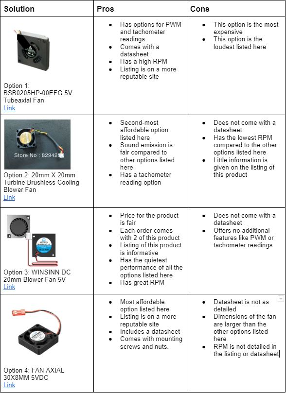

[< Back to home](./index.md)
# Appendix C: Component Selection
## Additional Content from Component Selection

### 5V Voltage Regulator

[Option 1](https://www.digikey.com/en/products/detail/microchip-technology/LM2575-5-0WU/1027656) | [Option 2](https://www.digikey.com/en/products/detail/umw/LM2576S-5-0/16705873) | [Option 3](https://www.digikey.com/en/products/detail/texas-instruments/LM2576S-5-0-NOPB/363654?utm_adgroup=Texas%20Instruments&utm_source=google&utm_medium=cpc&utm_campaign=Dynamic%20Search_EN_Focus%20Suppliers&utm_term=&utm_content=Texas%20Instruments&gclid=CjwKCAiAleOeBhBdEiwAfgmXf2c2ugLfdCNYGB94kFo48uVK8QLELq0C4U6XZMzKm66fvyKY-C7EUhoCbQEQAvD_BwE)

Choice: Choice 2 - UMW - LM2576S-5.0

Rationale: This IC is not much more expensive than the cheapest option, and is a big step up in the reputability of the manufacturer. We were initially going to go with option 1 because we are familiar with this chip as we used it in one of our ICC’s (the 3.3V version) but it was out of stock. We went with this alternative option because of its large stock.

### 3.3V Voltage Regulator

[Option 1](https://www.digikey.com/en/products/detail/microchip-technology/LM2575-3.3WU-TR/16679441?utm_adgroup=Integrated%20Circuits&utm_source=google&utm_medium=cpc&utm_campaign=Shopping_Supplier_Microchip_0150_Co-op&utm_term=&utm_content=Integrated%20Circuits&gclid=Cj0KCQiAz9ieBhCIARIsACB0oGKfTJQ9Fh5r8kRAPXw3mW0jDgG6PvythhTawmOSTd8LAARY7K1dAVcaAvMLEALw_wcB) | [Option 2](https://www.digikey.com/en/products/detail/umw/LM2576HVS-3-3/16705917) | [Option 3](https://www.digikey.com/en/products/detail/texas-instruments/LM2576S-3-3-NOPB/363653?utm_adgroup=Texas%20Instruments&utm_source=google&utm_medium=cpc&utm_campaign=Dynamic%20Search_EN_Focus%20Suppliers&utm_term=&utm_content=Texas%20Instruments&gclid=CjwKCAiAleOeBhBdEiwAfgmXfyY7m8TR0Y3jjgf2OoypRLGyGdHF-o645IfKzqnJ6S7oqHwb_tutQhoCqXcQAvD_BwE)

Choice: Option 1 - Microchip Technology - LM2575-3.3WU

Rationale: This IC is the cheapest option, and is a very reputable manufacturer. We also are familiar with this chip as we used it in one of our ICC’s (the 3.3V version). Worst case scenario we have to substitute it with the slightly more expensive and larger TI version.

### Humidity Sensor

[Option 1](https://www.digikey.com/en/products/detail/sensirion-ag/SHT40-AD1B-R2/13532084) | [Option 2](https://www.digikey.com/en/products/detail/bourns-inc/BPS240-D2P0-S10E/13967866) | [Option 3](https://www.digikey.com/en/products/detail/honeywell-sensing-and-productivity-solutions/HIH-5030-001/2051157)

Choice: Option 1 - SHT40-AD1B-R2 Humidity Sensor with I2C interface

Rationale: Product was found on a reputable source and manufacturer. The price is the most competitive out of the other options and has the best sensor accuracy. The sensor runs on I2C protocol which will fulfill one of the communication protocol requirements as well.

### Temperature Sensor

[Option 1](https://www.digikey.com/en/products/detail/umw/LM75BD/16705964) | [Option 2](https://www.digikey.com/en/products/detail/texas-instruments/TMP1075DR/9685283) | [Option 3](https://www.digikey.com/en/products/detail/texas-instruments/TMP126DCKR/16602359)

Choice: Option 2 - TMP1075DR Temperature Sensor with I2C protocol

Rationale: Product was found on a reputable source and manufacturer. It is accurate and has a wide temperature-sensing range. It is the cheapest option and the benefits match the other more expensive sensors. The sensor runs on I2C protocol which will fulfill one of the communication protocol requirements as well.

### Motor Driver

[Option 1](https://www.digikey.com/en/products/detail/infineon-technologies/IFX9201SGAUMA1/5415542) | [Option 2](https://www.arrow.com/en/products/drv8837cdsgr/texas-instruments?gclid=Cj0KCQiA2-2eBhClARIsAGLQ2Rl9xHBlbt7UCwxo7Ywy_aKi_S03iyxnpMGqoaIHov6f9jRs61epbAQaAshvEALw_wcB&gclsrc=aw.ds) | [Option 3](https://www.arrow.com/en/products/drv8870ddar/texas-instruments?gclid=Cj0KCQiA2-2eBhClARIsAGLQ2Rny7GgNM5NtZY7FRyjL6XpffISo_1cHM8pScRbb74RXiPLtRUcJp8MaAmV_EALw_wcB&gclsrc=aw.ds)

Choice: Option 1 - IFX9201SGAUMA1 Half Bridge Motor Driver 

Rationale: It is the only part that was able to be found that would actually suffice for this project, as finding surface mount motor driver parts that are readily available and have serial communication capabilities are not easy to find online. This part was initially given out to the class, which will help in getting acquainted with the part’s behavior and obtaining help with getting the part to work. This part also comes with a datasheet for further information. This part will require an additional power rail but will serve our project’s purpose, nonetheless.

### Fan

[Option 1](https://www.mouser.com/ProductDetail/Delta-Electronics/BSB0205HP-00EFG?qs=wnTfsH77Xs63f3riYfNd4A%3D%3D) | [Option 2](https://www.amazon.com/20mm-Turbine-Brushless-Cooling-Blower/dp/B00LG0EJFK) | [Option 3](https://www.amazon.com/WINSINN-Hydraulic-Bearing-20x6-3mm-Turbine/dp/B08ML4LWGD/ref=asc_df_B08ML39K1J/?tag=hyprod-20&linkCode=df0&hvadid=633095047807&hvpos=&hvnetw=g&hvrand=11582693811425458251&hvpone=&hvptwo=&hvqmt=&hvdev=c&hvdvcmdl=&hvlocint=&hvlocphy=9030039&hvtargid=pla-1685997476544&region_id=972485&th=1) | [Option 4](https://www.digikey.com/en/products/detail/adafruit-industries-llc/3368/6680553)

Choice: Option 4 - FAN AXIAL 30X8MM 5VDC

Rationale: The pricing for this device is the best out of all the options here, allowing for a couple more being available to order for spares. The listing for this product is also more reputable than some of the other options. This fan comes included with a datasheet and mounting screws, although the datasheet is not as detailed as Option 1’s. This product runs with 5V, and while it is larger than the other options with no RPM listed, it serves as a more efficient cooling fan that would best serve our project’s needs.

### Power Source

[Option 1](https://www.amazon.com/Amazon-Basics-Performance-All-Purpose-Batteries/dp/B0774D64LT/ref=asc_df_B00MH4QM1S/?tag=hyprod-20&linkCode=df0&hvadid=583815642163&hvpos=&hvnetw=g&hvrand=5970026934188101531&hvpone=&hvptwo=&hvqmt=&hvdev=c&hvdvcmdl=&hvlocint=&hvlocphy=9030100&hvtargid=pla-332122495433&region_id=972485&th=1) | [Option 2](https://www.amazon.com/EBL-Lithium-Battery-Rechargeable-Batteries/dp/B078HP76PG/ref=sr_1_7?crid=33RW3UQFBJ1CY&keywords=rechargeable+batteries+9v&qid=1666500132&qu=eyJxc2MiOiI1LjI5IiwicXNhIjoiNS4xOSIsInFzcCI6IjQuOTAifQ%3D%3D&s=electronics&sprefix=rechargeable+batteries+%2Celectronics%2C199&sr=1-7) | [Option 3](https://www.digikey.com/en/products/detail/us-electronics-inc./USE-18650-2200MAH/15781480?utm_adgroup=US%20ELECTRONICS%20INC.&utm_source=google&utm_medium=cpc&utm_campaign=Shopping_DK%2BSupplier_Tier%202%20-%20Block%201&utm_term=&utm_content=US%20ELECTRONICS%20INC.&gclid=Cj0KCQiAorKfBhC0ARIsAHDzslv-uqp_LuVAYAKcPoXCEjDeCUxs115HwhbcdR_NMl6o_bhkvuoHSJAaAirnEALw_wcB)

Choice: Option 3 - USE-18650-2200MAH 3.7V Lithium-ion Rechargeable Batteries.

Rationale: The reason we went with the 3.7V batteries is because this would remove the need for a 5V switching regulator for our project. The 3.7V would be sufficient to run our motor driver and motor and then would be stepped down to 3.3V for our microcontroller and other components. We deemed this the best option and most cost effective taking into consideration the money we’ll save from cutting out the 5V switching regulator.

### OLED Display

[Option 1](https://www.digikey.com/en/products/detail/universal-solder-electronics-ltd/OLED-128x64-1-3-I2C/16822118) | [Option 2](https://www.amazon.com/gp/product/B00VC2NEU8/ref=ppx_yo_dt_b_search_asin_title?ie=UTF8&psc=1) | [Option 3](https://www.digikey.com/en/products/detail/display-visions/EA-OLEDM204-LWA/9972246)

Choice: Option 1 - OLED 128x64 1.3” I2C

Rationale: The reason we went with option 1 was because of the price and the I2C protocol. We’ve been informed that the I2C protocol is easiest when coding an LCD screen. We also determined that our final product will be relatively small so the small size of the OLED will be perfect for our device.

&nbsp;

[Back to top](#top)
