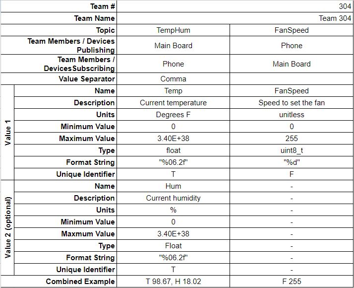

[< Back to home](./index.md)
<h1>Appendix E - MQTT Topic Table & Code</h1>

Since the device has the capability to access the internet via Wi-Fi, it would be able to utilize an MQTT server for our purposes. To effectively transmit and receive information between the PIC microcontroller and the server, topics would need to be implemented. Using this table, the team was able to organize the information going in and out between the PIC and the server.



This project would not have been able to run at all had it not been for the code that operated every subsystem involved. There were two sets of code involved for this project: the code running the PIC and the code running the ESP32.

Here is the code running the PIC:
```
#include <stdio.h>
#include <stdint.h>
#include <stdbool.h>
#include <xc.h>
#include "mcc_generated_files/mcc.h"
#include "mcc_generated_files/examples/i2c1_master_example.h"

// Variables

uint8_t temp_raw_1 = 0;
uint8_t temp_raw_2 = 0;
uint16_t temp_raw = 0;
float temp = 0.0;

uint8_t hum_raw_1 = 0;
uint8_t hum_raw_2 = 0;
uint16_t hum_raw = 0;
float hum = 0;

uint8_t fan_speed = 0;
uint8_t min_fan_speed = 20;
uint8_t fan_set=101;

uint8_t menu = 1;

void button_cb(void)
{
    __delay_ms(5);
    if(PB1_GetValue())
    {
        return;
    }
    menu = menu+1;
    if (menu > 2)
    {
        menu = 1;
    }
    
}

// Software debounce counts button presses lasting longer than 0.1 seconds
uint8_t debounce(void)
{   
    uint8_t i;
    for (i = 0; i < 100; ++i)
        {
        if(PB1_GetValue())
            {
            return 0;
            }
        __delay_ms(1);
        }
    return 1;
}

void main(void)
{

SYSTEM_Initialize();

// Motor Subsystem Initialization
CSN_SetLow();
PWM4_Initialize(); // Uncomment for PWM/DIR testing
TMR2_Initialize(); // Uncomment for PWM/DIR testing
SPI2_Open(SPI2_DEFAULT); //Activate SPI

// Controller Initialization
INTERRUPT_GlobalInterruptEnable();
INTERRUPT_PeripheralInterruptEnable();
IOCAF1_SetInterruptHandler(button_cb);

//Temp Sensor Initialization
EUSART1_Initialize();
I2C1_Initialize();

uint8_t temp_sensor_address = 0b1000000;
uint8_t temp_register_lower = 0x00;
uint8_t temp_register_upper = 0x01;

uint8_t hum_sensor_address = 0b1000000;
uint8_t hum_register_lower = 0x02;
uint8_t hum_register_upper = 0x03;

uint8_t device_config_register = 0x0E;
uint8_t device_config_setting = 0b01010000;
uint8_t device_command_register = 0x0F;
uint8_t measure_command = 0b00000001;

LED1_SetLow();
LED2_SetLow();

//Set the sensor to continuous measurement mode
I2C1_Write1ByteRegister(temp_sensor_address, device_config_register, device_config_setting);
I2C1_Write1ByteRegister(temp_sensor_address, device_command_register, measure_command);
__delay_ms(10);

printf("w"); // Print the welcome screen on startup
__delay_ms(1000);

while (1){
    // Blink the LED every loop so we know we're running
    LED1_Toggle(); 
    
    // Read from the temperature sensor
    temp_raw_1 = I2C1_Read1ByteRegister(temp_sensor_address, temp_register_lower);
    temp_raw_2 = I2C1_Read1ByteRegister(temp_sensor_address, temp_register_upper);   
    temp_raw = temp_raw_2 << 8 | temp_raw_1;
    temp = (((float) temp_raw)/(65536.0))*165.0 - 40.0;
    printf("%ft", temp);
    if (temp_raw!= 0)
    {
        LED2_Toggle();
        __delay_ms(100);
        LED2_Toggle();
        __delay_ms(100);
        LED2_Toggle();
        __delay_ms(100);
        LED2_Toggle();
    }

    __delay_ms(10);

    // Read from the humidity sensor
    hum_raw_1 = I2C1_Read1ByteRegister(hum_sensor_address, hum_register_lower);
    hum_raw_2 = I2C1_Read1ByteRegister(hum_sensor_address, hum_register_upper);
    hum_raw = hum_raw_2 << 8 | hum_raw_1;
    hum = (((float) hum_raw)/(65536.0))*100.0;
    printf("%fh", hum);
    __delay_ms(10);
    
        if (hum_raw!= 0)
    {
        LED2_Toggle();
        __delay_ms(100);
        LED2_Toggle();
        __delay_ms(100);
        LED2_Toggle();
        __delay_ms(100);
        LED2_Toggle();
    }

    // Menu control
    /**
    if (!PB1_GetValue())
        {
        menu = menu + debounce();    
        }
    if (menu > 3)
        {
        menu = 1;
        }
    */
    printf("%dm", menu);
    
    // Fan Control
    if (EUSART1_is_rx_ready())
    {
        fan_set = EUSART1_Read(); // Get the fan setting from ESP32

        LED2_Toggle();
        __delay_ms(10);
        LED2_Toggle();
        
    }
    
    if (fan_set > 100) // If fan setting is greater than 100,
    {
        fan_speed = min_fan_speed + 2*temp; // Use temperature control
        if (fan_speed > 100) // But cap the speed at 100
        {
            fan_speed = 100; // 
        }
    }
    else
    {
        fan_speed = fan_set; // If fan setting is between 0 and 100, then set the speed to that
    }
     
    fan_speed = fan_set;
    PWM4_LoadDutyValue(fan_speed * 65535 / 100);
    printf("%df",fan_speed);
   
    
    __delay_ms(500);
}
}
```
And here is the code running the ESP32:

my_oled_1.py:
```
from machine import Pin, SoftI2C
import ssd1306
import gfx
from time import sleep

i2c = SoftI2C(scl=Pin(22), sda=Pin(21))

oled_width = 128
oled_height = 64
oled = ssd1306.SSD1306_I2C(oled_width, oled_height, i2c)
graphics = gfx.GFX(oled_width, oled_height, oled.pixel)

def print_welcome_screen():
    oled.fill(0)
    oled.text("EGR 314 Team 304", 0, 0)
    oled.text("Trent Packer",0,10)
    oled.text("Cayman Preston",0,20)
    oled.text("Brendon Salido",0,30)
    oled.text("Levi Transtrum",0,40)
    oled.text("Welcome!", 32, 54)
    oled.show()

    
def print_data(msg, x):
    print("print_data was called")
    my_string = msg.decode('utf-8') # or my_string = str(msg, 'utf-8')
    my_strings = my_string.split(" ")
    my_values = [float(item) for item in my_strings]
    oled.fill(0)
    for ii, item in enumerate(my_values):
        oled.text(str(item), x, 10*ii)
    oled.show()
    pass

def print_sensor_data(temp, hum):
    oled.fill(0)
    oled.text("EGR 314 Team 304", 0, 0)
    
    oled.text("Temp:", 0, 20)
    oled.text(str(temp), 64, 20)
    oled.text("C", 118, 20)

    oled.text("RH:", 0, 30)
    oled.text(str(hum), 64, 30)
    oled.text("%", 118, 30)
    oled.show()
    pass

def plot_data(msg):
    print("plot_data was called")
    my_string = msg.decode('utf-8') # or my_string = str(msg, 'utf-8')
    my_strings = my_string.split(" ")
    my_values = [float(item) for item in my_strings]
    max_val = max(my_values)
    
    oled.fill(0)
    oled.text(str(max(my_values)), 64, 0)
    oled.text(str(min(my_values)), 64, 54)
    
    for i in range(len(my_values)-1):
        i+=1
        graphics.line((i-1)*128//(len(my_values)-1), 64-int(64*my_values[i-1]/max_val), i*128//(len(my_values)-1), 64-int(64*my_values[i]/max_val), 1)
        oled.show()
```

async_mqtt_uart_2.py:
```
# Derived from: 
# * https://github.com/peterhinch/micropython-async/blob/master/v3/as_demos/auart.py
# * https://github.com/tve/mqboard/blob/master/mqtt_async/hello-world.py


from mqtt_async import MQTTClient, config
import uasyncio as asyncio
import time
from machine import UART
from machine import Pin
import my_oled
import logging
logging.basicConfig(level=logging.DEBUG)

MAXTX = 4

# Change the following configs to suit your environment
TOPIC_PUB_TEMP = 'EGR314/Team304/Temperature'
TOPIC_PUB_HUM = 'EGR314/Team304/Humidity'
TOPIC_PUB_MENU = 'EGR314/Team304/Menu'
TOPIC_PUB_FAN = 'EGR314/Team304/FanSpeed'

TOPIC_SUB = 'EGR314/Team304/FanSet'
MENU = 1
config.server = 'egr3x4.ddns.net' # can also be a hostname
config.ssid     = 'Levi'
config.wifi_pw  = 'FunkyFresh'
data = []

uart = UART(2, 9600,tx=16,rx=17)
uart.init(9600, bits=8, parity=None, stop=1,flow=0) # init with given parameters
led = Pin(2,Pin.OUT)

async def receiver():
    global MENU
    b = b''
    temp = 0
    hum = 0
    sreader = asyncio.StreamReader(uart)
    while True:
        res = await sreader.read(1)      
        if res==b't': # If you get a temperature reading...
            await client.publish(TOPIC_PUB_TEMP, b, qos=1) #Publish it
            temp = b
            b = b''
        elif res==b'h': # If you get a humidity reading...
            await client.publish(TOPIC_PUB_HUM, b, qos=1)
            hum = b
            b = b''
        elif res==b'm': # If you get a menu reading...
            await client.publish(TOPIC_PUB_MENU, b, qos=1)
            MENU = b
            b = b''
        elif res==b'f': # If you get a fan reading...
            await client.publish(TOPIC_PUB_FAN, b, qos=1)
            #print('published', b)
            b = b''
        elif res==b'w': # If you get a welcome screen command...
            my_oled.print_welcome_screen()
            b = b''        
        else:
            b+=res
            
        if MENU == b'1':
            my_oled.print_welcome_screen()
        else:
            my_oled.print_sensor_data(temp, hum) # Print it    


def callback(topic, msg, retained, qos):
    print('callback',topic, msg, retained, qos)
    while (msg):
        msg = msg.decode()
        msg = int(msg)
        msg = bytearray([msg])
        uart.write(msg)
        time.sleep(.01)
        msg = 0
        
        # toggle the onboard LED
        led.value(led.value()^1)

    # uart.write('\r\n')
    time.sleep(.01)
  
async def conn_callback(client): await client.subscribe(TOPIC_SUB, 1)

async def main(client):
    await client.connect()
    asyncio.create_task(receiver())
    while True:
        await asyncio.sleep(1)

config.subs_cb = callback
config.connect_coro = conn_callback

client = MQTTClient(config)
loop = asyncio.get_event_loop()
loop.run_until_complete(main(client))
```
