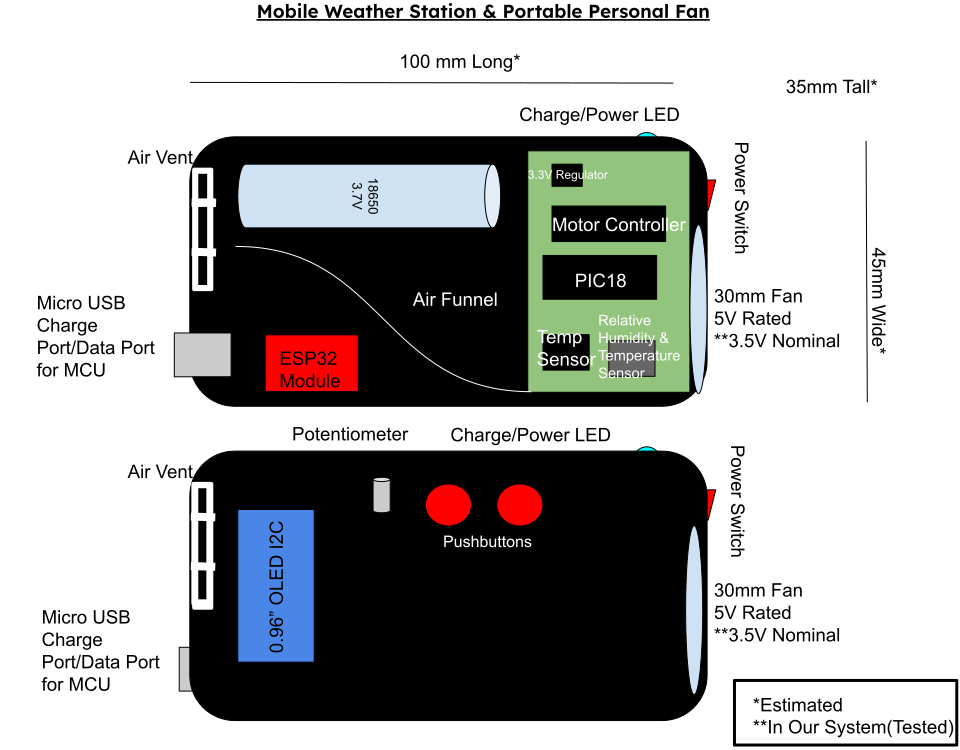
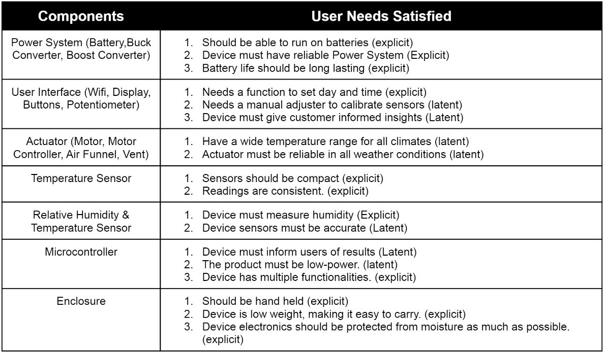
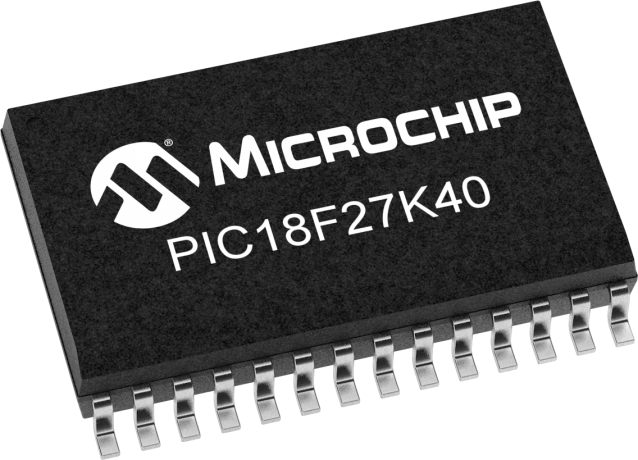
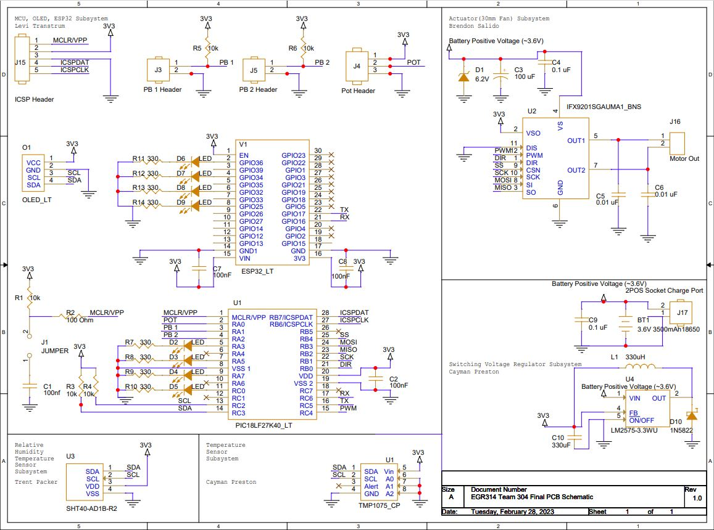

<h1 align="center">Checkpoint 2 Presentation - Team 304 - Portable Weather Station & Portable Personal Fan</h1>

&nbsp;

## Checkpoint 1 Presentation
<iframe width="956" height="538" src="https://www.youtube.com/embed/TLzWeIzh0lc" title="Checkpoint 1 Presentation Team 304" frameborder="0" allow="accelerometer; autoplay; clipboard-write; encrypted-media; gyroscope; picture-in-picture; web-share" allowfullscreen></iframe>

&nbsp;

## Introduction

Portable weather stations are used in a wide variety of applications. Some use them for personal applications such as in residential homes and farmlands to predict weather conditions. Others use them for more critical applications such as emergency responders conducting hazard analysis to run more accurate tests on the weather to guide them in decisions regarding public safety. These devices are in high demand and are always in need of being improved while minimizing the cost for both personal and emergency applications. Users describe difficulty with the longevity of the batteries, the accuracy of sensors, the range of applications, and the wireless connectivity of devices.

## Objectives

The aim for this project is to design and build a reliable, attractive, and functional weather station with a small form factor. The product will be similar in quality to commercially available, professionally designed products and that are financially available for all users. The product will solve real world environmental problems while improving on the accuracy and range of serial sensors such as temperature, humidity, atmospheric pressure, and wind speed sensors. As a team, the objective is to create a mobile weather station that stands out against the other project teams and competes with the devices currently available. Our main competitors will be the handheld anemometer by Intendvision, the Kestrel 3000 pocket weather meter, the HODIK weather station, the La Crosse Personal Weather Station, and the Netatmo weather station. Based on the user feedback from the devices of our competitors, we will aim to increase the longevity of the battery life of these devices, the accuracy of the temperature and other serial sensors, integrate more sensing options, and improve the wireless connection between devices.

## Selected Design

After some deliberation amongst the team, this design was ultimately chosen. It's a small handheld weather station that's easy to place down to take measurements. It has a temperature and humidity sensor to obtain data from its surroundings. It also features an actuator in the form of a fan that serves to provide airflow through the device to cool the internal components and work as a personal fan for the user. There is an OLED display that would display information obtained from the data the sensors collect. The content displayed functions performed by the device would be configured via a potentiometer and a couple of buttons, allowing for simple display adjustments and menu navigation. An ESP32 module would also be implemented to permit the device to exchange data through wifi. All of these components would be powered by a 3.7 V battery which is fed through a 3.3 V regulator. Power could be turned on/off through a switch on the side of the device, and the power would be indicated through an LED that would be mounted on the side. 

For the sake of clarity, here are a couple of screenshots of the 3D model that will serve as the enclosure for the circuitry.
.jpg "Enclosure (Isometric) 1")

.jpg "Enclosure (Isometric) 2")

Out of 70 unique user needs that were identified by the team, this was the list of relevant user needs that were identified by team that this design satisfies. All of them being sorted according to subsystem.

&nbsp;

## Block Diagram

Once we developed out final project design concept, we then developed a block diagram to identify the individual subsystems needed to fulfil the project requirements and develop our project. We separted our design into four main subsystems: Power Supply subsystem, Microcontroller and OLED subsystem, Temperature Sensor subsystem, Humidity Sensor subsystem, and Motor Controller subsystem.

_SVG.svg "Team 304 Block Diagram")

The Power Subystem uses a switching voltage regulator to output 3.3V to supply power to the microcontroller, temperature sensor, and humidity sensor. The Microcontrooler is an 8-bit microcontroller with MQTT, UART, PWM, SPI and I2C which fulfills project requirements. The Temperature sensor and Humidity sensor run on I2C protocol which fulfills one of the communication protocol requirements. The Motor Controller subsystem drives the motor using SPI communication protocol which fulfills project requirements. All components are surface-mount components and each pinout is labeled on the microcontroller block with their specific communication protocols.

&nbsp;

## Component Selection

[Component Selection.pdf](https://github.com/EGR314-Team-304/EGR314-Team-304.github.io/files/10863817/Component.Selection.pdf)

### 5V Voltage Regulator

This IC is not much more expensive than the cheapest option, and is a big step up in the reputability of the manufacturer. We were initially going to go with option 1 because we are familiar with this chip as we used it in one of our ICC’s (the 3.3V version) but it was out of stock. We went with this alternative option because of its large stock.

### 3V Voltage Regulator

This IC is the cheapest option, and is a very reputable manufacturer. We also are familiar with this chip as we used it in one of our ICC’s (the 3.3V version). Worst case scenario we have to substitute it with the slightly more expensive and larger TI version.

### Humidity Sensor

Product was found on a reputable source and manufacturer. The price is the most competitive out of the other options and has the best sensor accuracy. The sensor runs on I2C protocol which will fulfill one of the communication protocol requirements as well.

### Temperature Sensor

Product was found on a reputable source and manufacturer. It is accurate and has a wide temperature-sensing range. It is the cheapest option and the benefits match the other more expensive sensors. The sensor runs on I2C protocol which will fulfill one of the communication protocol requirements as well. 

### Motor Driver

It is the only part that was able to be found that would actually suffice for this project, as finding surface mount motor driver parts that are readily available and have serial communication capabilities are not easy to find online. This part was initially given out to the class, which will help in getting acquainted with the part’s behavior and obtaining help with getting the part to work. This part also comes with a datasheet for further information. This part will require an additional power rail but will serve our project’s purpose, nonetheless.

### Fan

The pricing for this device is the best out of all the options here, allowing for a couple more being available to order for spares. The listing for this product is also more reputable than some of the other options. This fan comes included with a datasheet and mounting screws, although the datasheet is not as detailed as Option 1’s. This product runs with 5V, and while it is larger than the other options with no RPM listed, it serves as a more efficient cooling fan that would best serve our project’s needs.

### Power Source

The reason we went with the 3.7V batteries is because this would remove the need for a 5V switching regulator for our project. The 3.7V would be sufficient to run our motor driver and motor and then would be stepped down to 3.3V for our microcontroller and other components. We deemed this the best option and most cost effective taking into consideration the money we’ll save from cutting out the 5V switching regulator.

### OLED Display

The reason we went with option 1 was because of the price and the I2C protocol. We’ve been informed that the I2C protocol is easiest when coding an LCD screen. We also determined that our final product will be relatively small so the small size of the OLED will be perfect for our device.

## Power Budget
Gathering the information provided by each component's datasheet and additionally provided information, the power budget was able to be created to give the team insight on how much power the overall system consumed. 

| Name Of Component                  | Voltage | Nominal Current Supply(mA) |
|------------------------------------|---------|----------------------------|
| Battery                            |     3.6 |                       2200 |
| Motor                              |     3.6 |                        -20 |
| 3.3V Regulator                     |     3.3 |                        -75 |
| PIC18                              |     3.3 |                       -100 |
| Motor Controller                   |     3.3 |                        -20 |
| Temperature Sensor                 |     3.3 |                     -0.003 |
| Relative Humidity Sensor           |     3.3 |                     -0.004 |
| ESP32                              |     3.3 |                       -500 |
|              Battery Current Left: |         |                   1484.993 |
|         Current Draw on Regulator: |         |                    695.007 |
| Current Output Limit on Regulator: |         |                       1000 |
|            Regulator Current Left: |         |                    304.993 |

&nbsp;

## Microcontroller Selection

In order to narrow down the vast pool of 8 bit microcontrollers, we first identified our specific product's requirements. We referred to the block diagram created earlier to get a pin count of the list of capabilites we would need to look for in an MCU. This included I2C peripherals, for our temperature and humidity sensors, an SPI peripheral for the fan motor driver motor driver, and a UART peripheral for communication with an ESP32 board. Next, we used the Microchip Parametric Search Tool to search for 8 bit microcontrollers that met, at a minimum all of our project-specific requirements. We referenced datasheets to collect specs on each microcontroller for evaluation.

[Click image for PIC product page]

The final product, the PIC18LF27K40, hit the goldilocks zone for us. It had all of the required peripherals and just a few extra pins, in a reasonably sized package. However, one thing that really sold us on the PIC18LF27K40 was its ability to remap peripherals onto many pins. This would allow us lots of flexibility with our pin mapping and potential solutions to any mistakes made.

&nbsp;

## Hardware Proposal

With all of the components selected for the project, the next step was to put them all together in a complete and comprehensive schematic. The schematic was split into parts to clearly the depict the different subsystems involved.

[Click the schematic image for PDF view]

For the complete bill of materials categorized for each subsystem, click [here](./Bill_of_Materials.xlsx)

## Software Proposal

In order to model and lay out the overall framework and architecture of the code required to run our product, our team created an activity diagram. The goal of the diagram was not necessarily to write any functional code, but to establish the overall functionality of our software. We did so by creating a UML state chart mapping the intended flow of our program. 

&nbsp;

### Software Proposal UML Activity Diagram

### Functionality

Our program will begin with the initialization of necessary peripherals, including EUSART, I²C, and SPI. The initialization functions will run only once, at the beginning of the program. Next, we will enter the main loop of the program.

Within the main loop of the program, the PIC MCU will repeatedly execute a set of instructions. First, it will utilize the I2C protocol to acquire data from the temperature and humidity sensors. Next, it will analyze the data gathered from the sensors and make a determination as to what speed the fan should operate at. This decision is based on the temperature and humidity readings. After deciding on the appropriate fan speed, the PIC MCU will transmit this information over the SPI protocol to the motor, which controls the fan's rotational speed. Finally, the PIC MCU will take into account the current menu setting and utilize the USART protocol to send the appropriate data to the LED screen. The data displayed on the LED screen is based on the settings that have been selected by the user. This entire process is continuously repeated in a loop, allowing for the system to consistently monitor and adjust the temperature and humidity levels as necessary.

If, at any point during the main loop, the menu button is pressed, an interrupt is triggered and the program enters the menu subloop. The menu index is incremented, which determines the current mode of operation within the menu subloop. The menu subloop has been designed to provide the user with various options for interacting with the system.

In mode 1, the program simply displays the current temperature and humidity values. This allows the user to monitor the current state of the system without making any changes.

In mode 2, the program displays the maximum temperature and humidity recorded in the current session. This requires the program to keep track of the highest temperature and humidity readings received since the session started. To accomplish this, the program continuously compares the highest recorded temperature and humidity values with the current readings and updates the maximum values as necessary.

In mode 3, the user can calibrate the system by entering known temperature and humidity values. The program then calculates the difference between the measured and input values and saves this difference as an offset to be applied to all future readings. This allows the system to be adjusted to account for any discrepancies in the sensors or other environmental factors. 

By providing these different modes of operation, the program allows for greater flexibility and customization of the system. Additionally, the use of interrupts and menu indexing provides a user-friendly interface that allows for easy navigation and control of the system.

### Rationale

Our team carefully considered the suite of features that our hardware could theoretically be used for and aimed to provide as many features as possible with a simple and understandable user interface. The main loop of the program was designed to continuously read data from the temperature and humidity sensors, process that data to adjust the fan's speed, output data over SPI to the motor, and transmit selected data over USART to the LED screen. This was done to ensure that the system was constantly monitoring and adjusting to changes in temperature and humidity, and that users could easily see the current readings on the LED screen. The menu subloop was implemented to provide users with a way to access and customize different settings on the product, so as to increase the product's flexibility and user-friendliness. The three different modes of the menu system were designed to provide users with different options based on their needs, such as viewing current or historical weather data. Calibration of the device was deemed a necessary option to ensure that users could trust the data provided by the system and make informed decisions based on that data. We also wanted the user interface to be simple, intuitive, and responsive. To make the product more user-friendly and accessible to a wider range of users, we wanted the menu system to be easy to navigate and understand.

[< Back to home](./index.md)
