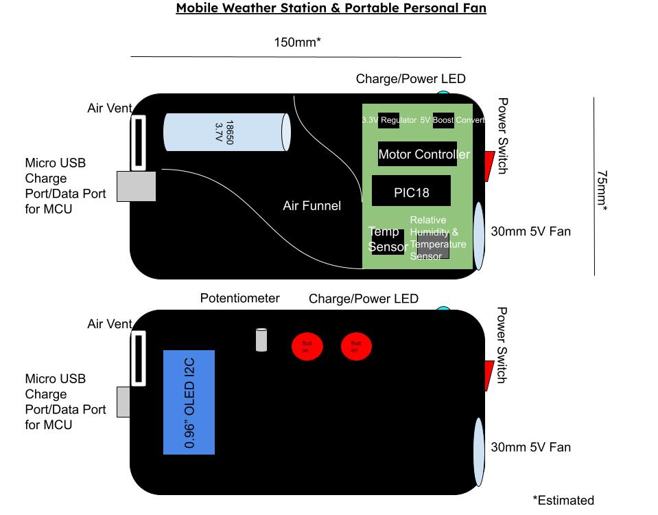

# 
Checkpoint 2 Presentation - Team 304 - Portable Weather Station & Portable Personal Fan

&nbsp;

## Checkpoint 1 Presentation

&nbsp;

## Selected Design

<!--- Write a description here about what's going on in the design.-->

&nbsp;

## Block Diagram

<!--- Add "connective tissue" to lead into the Block Diagram itself.-->

_SVG.svg "Team 304 Block Diagram")

<!--- Write a description about what subsystems are in use here and how they satisfy the requirements for the project.-->

&nbsp;

## Component Selection

<!--- Add screenshots of each /selected/ component and their respective rationale for this portion.-->

<!--- Add screenshots of the Power Budget and add it here with a small description to explain what's going on in it.-->

&nbsp;

## Microcontroller Selection

 

<!--- Rearrange some of the wording on the existing report to flow with this section. (Look at section of text just above the image on the report)-->

