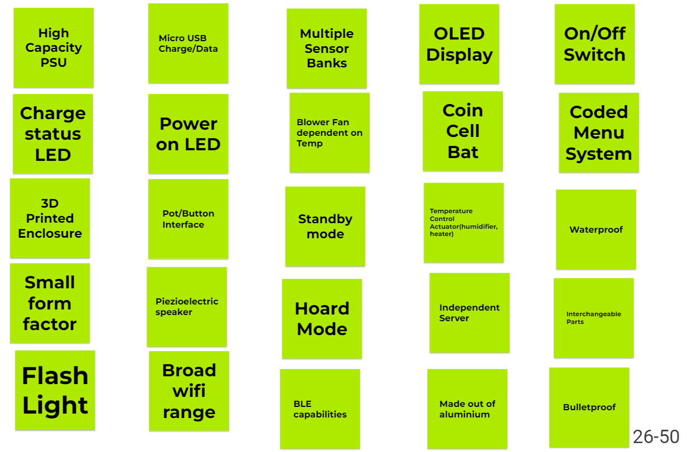
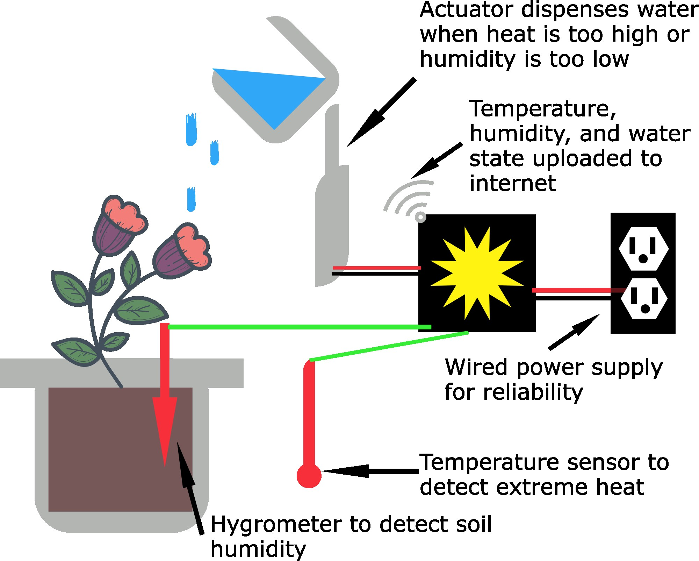

# Design Ideation

### Brainstorming Ideas

For our brainstorming, we decided to come up with 100 ideas by dedicating 4 frames on Jamboard, one for each team member. Each team member would think up 25 ideas, place them on sticky notes on their dedicated frame, and use a different color to serve as a visual aid for the next step. Here are the 4 frames we ended up with:

### Grouped and Sorted Ideas

Once all of our ideas were created, we then sorted them according to the 3 design sketches our team made. We rearranged our Jamboard to have 3 frames, one for each design sketch and placed our ideas into the frames of which sketch they described. For the sake of completeness and posterity, we added a fourth frame to hold any unused ideas that didn't fit in any of the 3 frames mentioned. Here are what those frames looked like:

### Product Concept Sketch #1 - Dynamic Remote Weather Station

Our first design concept comes in a small handheld device that can be designed to work in-hand or when placed in a particular spot. The shape of the design makes it simpler to place on a desired surface. The sensors, temperature and humidity, would be available to use for data collection. A fan in the device would be activated when the temperature sensor read above a certain threshold to aid in cooling the device's internals. An interesting feature of this concept involves doubling the sensors and placing the redundant pair on the opposite side of the device. This redundancy would allow the device to account for small deviations in its readings to display and transmit more accurate data. The device would have a USB port that would serve as both a charge port and data port. A display would be used to show readings with a potentiometer and a couple of buttons to operate the device. 

### Product Concept Sketch #2 - Handheld Weather Station

For the second concept, a hilt-like handheld device was considered. With folding arms having a temperature sensor on one arm and a humidity sensor on the other. It would be a compact and traveler-friendly design. A loop at the bottom of the device would allow for it to be clipped onto something for carrying purposes. The arms of the device would dictate which of the two sensors would be in use at that time. If both arms were to be extended during use, the device would obtain readings from both sensors on their respective arm. The fan in the center of the device would always be available to use, serving both as a sensor for wind speed and as a method to recharge the batteries of the device while in use. Units and sensors could be toggled and data would be capable of being transmitted to another device via wi-fi while also being shown on the device's backlit display.

### Product Concept Sketch #3 - Automatic Plant Hydrator

Our third design concept revolved around solving a problem that plant owners sometimes encounter: Keeping a plant hydrated while away. This design would seek to measure the humidity level of the soil and the ambient temperature. When the humidity drops or the temperature becomes too high, an actuator would be triggered to dispense water and hydrate the plant. The plant owner would be able to remotely monitor the humidity and temperature and view how much water had been dispensed. The design would be powered by a wall adapter for simplicity and reliability.

&nbsp;

&nbsp;

[< Back to home](./index.md)
