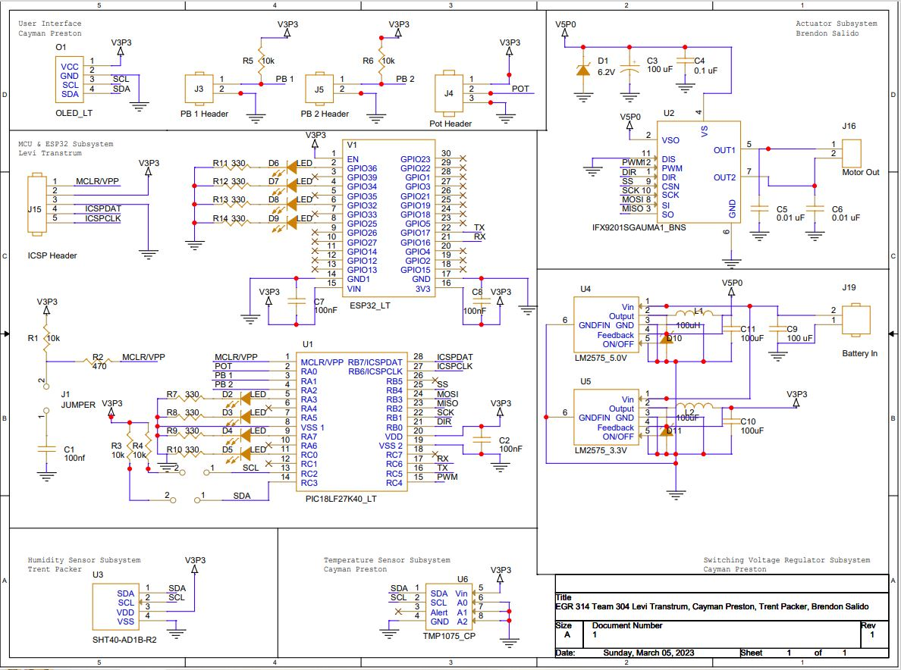
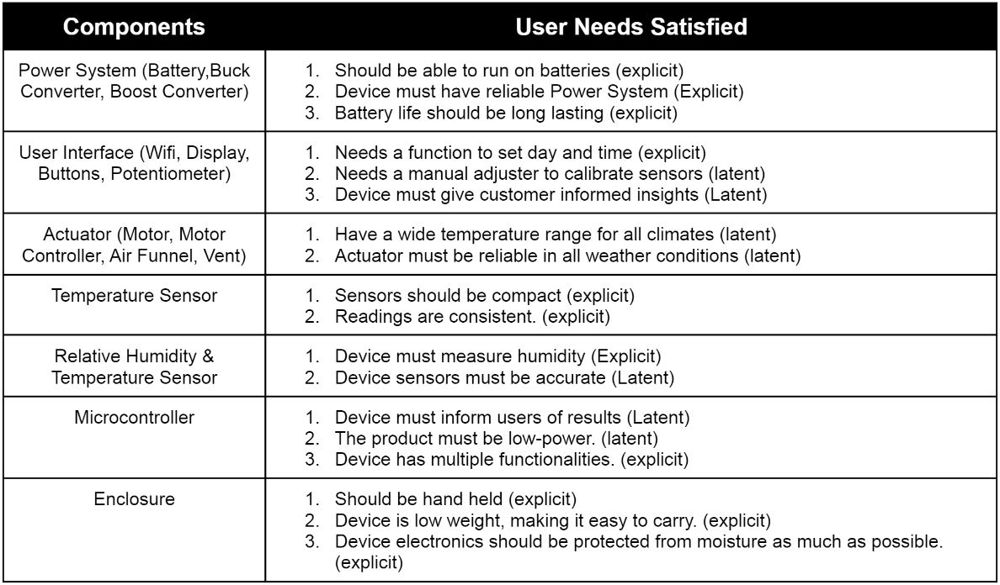

[< Back to home](./index.md)

# Hardware Proposal

With all of the components selected for the project, the next step was to put them all together in a complete and comprehensive schematic. The schematic was split into parts to clearly depict the different subsystems involved.

[Click the schematic image for PDF view]

We begin by looking at the PIC18 component, the microprocessor that will run the entirety of the design. It is here where the sensors, actuator, buttons, display, potentiometer, and ESP32 module will operate from. The sensors depicted here utilize the I2C communication protocol while the motor controller uses the SPI communication protocol, satisfying the project's requirements thus far. There would also be an ESP32 module which would serve as the means for data exchange via bluetooth; another requirement satisfied. The combined components of the OLED display, pushbuttons and potentiometer wouldn't count towards the project's required subsystems, but would prove beneficial and important to the overall function of this project. The power subsystem would work under a switching voltage regulator setup between a 3.3 V and 5 V regulator setup to provide to the other subsystems, all hooked up to a couple of 3.7 V batteries for power.

This design sought to address more specific user needs and requirements that were listed during the User Needs, Benchmarking and Requirements portion. Out of 70 unique user needs that were identified by the team, this was the list of relevant user needs that were identified by the team that this design satisfies, all of them being sorted according to subsystem.

For the bill of materials of this design, please refer to [Appendix D](./Appendix-D.md).

&nbsp;

&nbsp;

[Back to top](#top)
