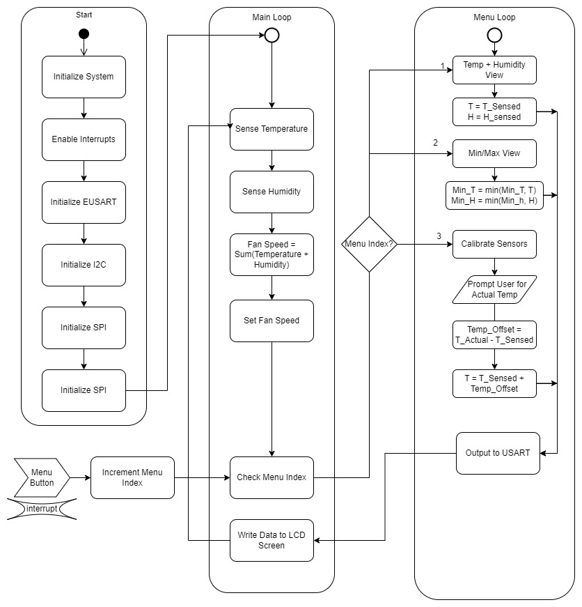

# Software Proposal

In order to model and lay out the overall framework and architecture of the code required to run our product, our team created an activity diagram. The goal of the diagram was not necessarily to write any functional code, but to establish the overall functionality of our software. We did so by creating a UML state chart mapping the intended flow of our program. 

&nbsp;

### Software Proposal UML Activity Diagram

### Functionality

Our program will begin with the initialization of necessary peripherals, including EUSART, I²C, and SPI. The initialization functions will run only once, at the beginning of the program. Next, we will enter the main loop of the program.

Within the main loop of the program, the PIC MCU will repeatedly execute a set of instructions. First, it will utilize the I2C protocol to acquire data from the temperature and humidity sensors. Next, it will analyze the data gathered from the sensors and make a determination as to what speed the fan should operate at. This decision is based on the temperature and humidity readings. After deciding on the appropriate fan speed, the PIC MCU will transmit this information over the SPI protocol to the motor, which controls the fan's rotational speed. Finally, the PIC MCU will take into account the current menu setting and utilize the USART protocol to send the appropriate data to the LED screen. The data displayed on the LED screen is based on the settings that have been selected by the user. This entire process is continuously repeated in a loop, allowing for the system to consistently monitor and adjust the temperature and humidity levels as necessary.

If, at any point during the main loop, the menu button is pressed, an interrupt is triggered and the program enters the menu subloop. The menu index is incremented, which determines the current mode of operation within the menu subloop. The menu subloop has been designed to provide the user with various options for interacting with the system.

In mode 1, the program simply displays the current temperature and humidity values. This allows the user to monitor the current state of the system without making any changes.

In mode 2, the program displays the maximum temperature and humidity recorded in the current session. This requires the program to keep track of the highest temperature and humidity readings received since the session started. To accomplish this, the program continuously compares the highest recorded temperature and humidity values with the current readings and updates the maximum values as necessary.

In mode 3, the user can calibrate the system by entering known temperature and humidity values. The program then calculates the difference between the measured and input values and saves this difference as an offset to be applied to all future readings. This allows the system to be adjusted to account for any discrepancies in the sensors or other environmental factors. 

By providing these different modes of operation, the program allows for greater flexibility and customization of the system. Additionally, the use of interrupts and menu indexing provides a user-friendly interface that allows for easy navigation and control of the system.

### Rationale

Our team carefully considered the suite of features that our hardware could theoretically be used for and aimed to provide as many features as possible with a simple and understandable user interface. The main loop of the program was designed to continuously read data from the temperature and humidity sensors, process that data to adjust the fan's speed, output data over SPI to the motor, and transmit selected data over USART to the LED screen. This was done to ensure that the system was constantly monitoring and adjusting to changes in temperature and humidity, and that users could easily see the current readings on the LED screen. The menu subloop was implemented to provide users with a way to access and customize different settings on the product, so as to increase the product's flexibility and user-friendliness. The three different modes of the menu system were designed to provide users with different options based on their needs, such as viewing current or historical weather data. Calibration of the device was deemed a necessary option to ensure that users could trust the data provided by the system and make informed decisions based on that data. We also wanted the user interface to be simple, intuitive, and responsive. To make the product more user-friendly and accessible to a wider range of users, we wanted the menu system to be easy to navigate and understand.

&nbsp;

&nbsp;

[< Back to home](./index.md)
