[< Back to home](./index.md)
<h1>Team Report - Remote Weather Station</h1>

&nbsp;

<h2 align="center">Checkpoint 1 Presentation</h2>
<iframe width="637" height="358" src="https://www.youtube.com/embed/TLzWeIzh0lc" title="Checkpoint 1 Presentation Team 304" frameborder="0" allow="accelerometer; autoplay; clipboard-write; encrypted-media; gyroscope; picture-in-picture; web-share" allowfullscreen></iframe>

&nbsp;

## Table of Contents

[Introduction](https://egr314-team-304.github.io/team-report.html#introduction)

[Team Organization](https://egr314-team-304.github.io/team-report.html#team-organization)

- [Establishing the Team](https://egr314-team-304.github.io/team-report.html#establishing-the-team)
- [Charter](https://egr314-team-304.github.io/team-report.html#charter)
- [Product Mission Statement](https://egr314-team-304.github.io/team-report.html#product-mission-statement)

[User Needs, Benchmarking, and Requirements](https://egr314-team-304.github.io/team-report.html#user-needs-benchmarking-and-requirements)

- [Objectives](https://egr314-team-304.github.io/team-report.html#objectives)
- [Stakeholders](https://egr314-team-304.github.io/team-report.html#stakeholders)
- [Use Cases](https://egr314-team-304.github.io/team-report.html#use-cases)
- [User Needs](https://egr314-team-304.github.io/team-report.html#user-needs)
- [Aspects and Product Requirements](https://egr314-team-304.github.io/team-report.html#aspects-and-product-requirements)
- [Open Questions](https://egr314-team-304.github.io/team-report.html#open-questions)
- [Milestones](https://egr314-team-304.github.io/team-report.html#milestones)

[Design Ideation](https://egr314-team-304.github.io/team-report.html#design-ideation)

- [Brainstorming Ideas](https://egr314-team-304.github.io/team-report.html#brainstorming-ideas)
- [Grouped and Sorted Ideas](https://egr314-team-304.github.io/team-report.html#grouped-and-sorted-ideas)
- [Product Concept Sketch #1 - Dynamic Remote Weather Station](https://egr314-team-304.github.io/team-report.html#product-concept-sketch-1---dynamic-remote-weather-station)
- [Product Concept Sketch #2 - Handheld Weather Station](https://egr314-team-304.github.io/team-report.html#product-concept-sketch-2---handheld-weather-station)
- [Product Concept Sketch #3 - Automatic Plant Hydrator](https://egr314-team-304.github.io/team-report.html#product-concept-sketch-3---automatic-plant-hydrator)

[Selected Design](https://egr314-team-304.github.io/team-report.html#selected-design)

[Block Diagram](https://egr314-team-304.github.io/team-report.html#block-diagram)

[Component Selection](https://egr314-team-304.github.io/team-report.html#component-selection)

- [5V Voltage Regulator](https://egr314-team-304.github.io/team-report.html#5v-voltage-regulator)
- [3V Voltage Regulator](https://egr314-team-304.github.io/team-report.html#3v-voltage-regulator)
- [Humidity Sensor](https://egr314-team-304.github.io/team-report.html#humidity-sensor)
- [Temperature Sensor](https://egr314-team-304.github.io/team-report.html#temperature-sensor)
- [Motor Driver](https://egr314-team-304.github.io/team-report.html#motor-driver)
- [Fan](https://egr314-team-304.github.io/team-report.html#fan)
- [Power Source](https://egr314-team-304.github.io/team-report.html#power-source)
- [OLED Display](https://egr314-team-304.github.io/team-report.html#oled-display)
- [Power Budget](https://egr314-team-304.github.io/team-report.html#power-budget)

[Microcontroller Selection](https://egr314-team-304.github.io/team-report.html#microcontroller-selection)

[Software Implementation](https://egr314-team-304.github.io/team-report.html#software-implementation)

- [Software Implementation UML Activity Diagram](https://egr314-team-304.github.io/team-report.html#software-implementation-uml-activity-diagram)
- [Functionality](https://egr314-team-304.github.io/team-report.html#functionality)
- [Rationale](https://egr314-team-304.github.io/team-report.html#rationale)
- [Top 5 Software Changes](https://egr314-team-304.github.io/team-report.html#top-5-software-changes)
- [Software Version 2.0](https://egr314-team-304.github.io/team-report.html#software-version-20)

[Hardware Implementation](https://egr314-team-304.github.io/team-report.html#hardware-implementation)

- [Hardware Version 2.0](https://egr314-team-304.github.io/team-report.html#hardware-version-20)

[System Verification](https://egr314-team-304.github.io/team-report.html#system-verification)

[Lessons Learned](https://egr314-team-304.github.io/team-report.html#lessons-learned)

[Recommendations for Future Students](https://egr314-team-304.github.io/team-report.html#recommendations-for-future-students)

&nbsp;

## Table of Figures

[Table 1 - Satisfied User Needs](https://egr314-team-304.github.io/team-report.html#table-1---satisfied-user-needs)

[Figure 1 - Design Ideas 1-25](https://egr314-team-304.github.io/team-report.html#figure-1---design-ideas-1-25)

[Figure 2 - Design Ideas 26-50](https://egr314-team-304.github.io/team-report.html#figure-2---design-ideas-26-50)

[Figure 3 - Design Ideas 51-75](https://egr314-team-304.github.io/team-report.html#figure-3---design-ideas-51-75)

[Figure 4 - Design Ideas 76-100](https://egr314-team-304.github.io/team-report.html#figure-4---design-ideas-76-100)

[Figure 5 - Design Concept 1 Ideas](https://egr314-team-304.github.io/team-report.html#figure-5---design-concept-1-ideas)

[Figure 6 - Design Concept 2 Ideas](https://egr314-team-304.github.io/team-report.html#figure-6---design-concept-2-ideas)

[Figure 7 - Design Concept 3 Ideas](https://egr314-team-304.github.io/team-report.html#figure-7---design-concept-3-ideas)

[Figure 8 - Miscellaneous Ideas](https://egr314-team-304.github.io/team-report.html#figure-8---miscellaneous-ideas)

[Figure 9 - Design Concept 1 Sketch](https://egr314-team-304.github.io/team-report.html#figure-9---design-concept-1-sketch)

[Figure 10 - Design Concept 2 Sketch](https://egr314-team-304.github.io/team-report.html#figure-10---design-concept-2-sketch)

[Figure 11 - Design Concept 3 Sketch](https://egr314-team-304.github.io/team-report.html#figure-11---design-concept-3-sketch)

[Figure 12 - Selected Design Sketch](https://egr314-team-304.github.io/team-report.html#figure-12---selected-design-sketch)

[Figure 13 - 3D Model Isometric 1](https://egr314-team-304.github.io/team-report.html#figure-13---3d-model-isometric-1)

[Figure 14 - 3D Model Isometric 2](https://egr314-team-304.github.io/team-report.html#figure-14---3d-model-isometric-2)

[Figure 15 - Block Diagram](https://egr314-team-304.github.io/team-report.html#figure-15---block-diagram)

[Table 2 - 5V Voltage Regulator](https://egr314-team-304.github.io/team-report.html#table-2---5v-voltage-regulator)

[Table 3 - 3V Voltage Regulator](https://egr314-team-304.github.io/team-report.html#table-3---3v-voltage-regulator)

[Table 4 - Humidity Sensor](https://egr314-team-304.github.io/team-report.html#table-4---humidity-sensor)

[Table 5 - Temperature Sensor](https://egr314-team-304.github.io/team-report.html#table-5---temperature-sensor)

[Table 6 - Motor Driver](https://egr314-team-304.github.io/team-report.html#table-6---motor-driver)

[Table 7 - Fan](https://egr314-team-304.github.io/team-report.html#table-7---fan)

[Table 8 - Power Source](https://egr314-team-304.github.io/team-report.html#table-8---power-source)

[Table 9 - OLED Display](https://egr314-team-304.github.io/team-report.html#table-9---oled-display)

[Figure 16 - Power Budget](https://egr314-team-304.github.io/team-report.html#figure-16---power-budget)

[Table 10 - Microcontroller Selection](https://egr314-team-304.github.io/team-report.html#table-10---microcontroller-selection)

[Figure 17 - PIC18F27K40](https://egr314-team-304.github.io/team-report.html#figure-17---pic18f27k40)

[Figure 18 - Software Diagram](https://egr314-team-304.github.io/team-report.html#figure-18---software-diagram)

[Figure 19 - Project Schematic](https://egr314-team-304.github.io/team-report.html#figure-19---project-schematic)

[Figure 20 - Top PCB Design](https://egr314-team-304.github.io/team-report.html#figure-20---top-pcb-design)

[Figure 21 - Bottom PCB Design](https://egr314-team-304.github.io/team-report.html#figure-21---bottom-pcb-design)

[Figure 22 - Top Physical PCB](https://egr314-team-304.github.io/team-report.html#figure-22---top-physical-pcb)

[Figure 23 - Bottom Physical PCB](https://egr314-team-304.github.io/team-report.html#figure-23---bottom-physical-pcb)

[Figure 24 - Verification Table](https://egr314-team-304.github.io/team-report.html#figure-24---verification-table)

&nbsp;

## Introduction

Portable weather stations are used in a wide variety of applications. Some use them for personal applications such as in residential homes and farmlands to predict weather conditions. Others use them for more critical applications such as emergency responders conducting hazard analysis to run more accurate tests on the weather to guide them in decisions regarding public safety. These devices are in high demand and are always in need of being improved while minimizing the cost for both personal and emergency applications. This project aims to create a product that provides functionality that is not already in the market while being reliable and having a small form factor. The most common issues brought up by consumers when looking up devices in the market currently involve a lack of battery longevity, calibration features, sensor-reading consistency, limited range of applications, and wireless features. This project also focuses on creating a product that will address these issues which are found in similar devices currently available for purchase.

&nbsp;

## Team Organization

### Establishing the Team

Upon establishing our team, we began discussing what our individual expectations were for this project. We immediately agreed that we wanted our design to stand out above the rest of the groups in both sections. With that in mind, we began forming goals that would help us develop our current knowledge and be successful in or primary objective. First, we want to create a final product that is a functioning and independent device that can perform in the Innovation Showcase. Second, we want to utilize and develop each team member’s knowledge and skills in embedded systems design. Third, we want to obtain a greater understanding of serial protocol communication, the different types of serial protocols available, and how they can function in unison within the application of our product. Fourth, we want to create a robust and reliable electrical design that is as close to a sellable product as possible. Fifth, we want to design and build a product that we can add to each of our resumes.

After establishing these goals, we developed the following Team Charter and Mission Statement: 

&nbsp;

### Charter

> *“Our team will work together to harness each of our collective abilities and experience to bring a robust and reliable product to the Innovation Showcase that we are proud of, can attract interest from viewers and employers, and can be worthy enough of recognition to add to our own resumes.”*  
&nbsp;

### Product Mission Statement

> *“To leverage each of our team member’s areas of expertise to design and build a reliable, attractive, and functional weather station with a small form factor. The product will solve a real world environmental problem using sensors and actuators. Our product will be similar in quality to commercially available, professionally designed products.”*  
&nbsp;

See [Appendix A - Team Organization](./Appendix-A.md) for further Team Organization content.

&nbsp;

## User Needs, Benchmarking, and Requirements

### Objectives

The aim for this project is to design and build a reliable, attractive, and functional weather station with a small form factor. The product will be similar in quality to commercially available, professionally designed products and that are financially available for all users. The product will solve real world environmental problems while improving on the accuracy and range of serial sensors such as temperature, humidity, atmospheric pressure, and wind speed sensors. As a team, the objective is to create a mobile weather station that stands out against the other project teams and competes with the devices currently available. Our main competitors will be the handheld anemometer by Intendvision, the Kestrel 3000 pocket weather meter, the HODIK weather station, the La Crosse Personal Weather Station, and the Netatmo weather station. Based on the user feedback from the devices of our competitors, we will aim to increase the longevity of the battery life of these devices, the accuracy of the temperature and other serial sensors, integrate more sensing options, and improve the wireless connection between devices.

&nbsp;

### Stakeholders
- Target group: Middle-income individuals who are avid nature fans or who have active outdoor hobbies.
- Target purchaser: Target group profile with special attention to Full Nest I and Full Nest II mothers.
- Customer service: Prefers easy-to-repair, cheap to replace, and simple to use product.
- Marketing & Sales division: Looks for unique selling points that distinguishes our product from countless competitors on the market.
- Retailers: Prefer products that can withstand a wide range of storage conditions including variations in temperature, vibration, humidity, and atmospheric pressure, and have a strong and compact, theft, and vandalism-proof packaging.
- Regulatory instances: The product needs to comply with CE guidelines in Europe, including 2014/53/EU, 2011/65/EU, and 2009/125/EC as well as RoHS: EN50581:2012, FCC Rules part 15 ID BCG-A2083 and BCG-A2084 for the United States, Canada IC numbers 579C-A2083 and 579C-A2084, TP TC 020/2011 for Russia, Mexico NOM conformity to A2083, A2084, and A2083, Turkey’s AEEE compliance, Japan VCCI codes 003-190159, D190123003, 003-190158, and D190122003, Singapore IMDA DB00063, and Malaysia MCMC-CIDF15000007.

&nbsp;

### Use Cases

We envision our product being used by everyday people with an interest in the weather, such as the people described in the following stories.

#### **John**
> John is a 68-year-old man who has a small garden in his backyard where he grows vegetables. He has been gardening for many years and takes great pride in his crops. However, in recent years, he has been facing a problem with weather events destroying his plants. He would often come home to find his garden flooded or his plants wilted due to extreme heat. Determined to save his crops, John decided to invest in a weather station. The weather station senses and reports weather conditions such as temperature, humidity, and precipitation. With this information, John is able to take the necessary precautions to protect his garden from the elements. He sets up a watering system to protect his plants from the heat and a drainage system to prevent flooding. He also sets up a small greenhouse to protect his plants from frost. Thanks to the weather station, John is able to save his crops and continue enjoying the fruits of his labor.  

#### **Samantha** 
> Samantha is a 12-year-old girl who has always been fascinated by the weather. She would often spend her free time pretending to be a news weather anchor, giving forecasts to her family and friends. However, her pretend forecasts were based on guesses rather than actual data. She always wished she had some real equipment to help her understand the weather better. For her birthday one year, Samantha's parents surprised her with a weather station. The weather station can sense temperature and precipitation, and it was just what she needed to start her own weather observations. She set it up in the backyard and started tracking the weather patterns in her area. The data she collected was fascinating and helped her to understand the weather better. This made her even more determined to study to become a meteorologist. She would spend hours studying the data and learning more about the atmosphere. The weather station was her first step in becoming a real meteorologist, and she was so excited to see where it would take her.  

#### **Keith**
> Keith is an avid hunter. His favorite game to hunt is Elk. He typically goes up to Coconino National Forest to hunt some. However, he has noticed that the online weather results are not nearly as accurate as they claim to be. He did some research and found the Weather Station by Team 304 and was immediately impressed. He is able to set up several devices due to their affordability. They are light and compact so he can bring many out to the large area he hunts in, without weighing him down. But most importantly, he is able to get much more accurate local weather data, which is pivotal for his big game hunt.
&nbsp;

### User Needs

Our team employed a comprehensive methodology to identify and prioritize user needs for our product. We first examined reviews of competing products and observed the pros and cons of existing products to gain a deeper understanding of what customers liked and didn't like. This information was then translated into a list of 70 unique needs for our product. Our team identified the following needs from our complete list that are satisfied by our final project:

#### Table 1 - Satisfied User Needs
 

In order to effectively organize and prioritize these needs, we assigned them to five categories: Mechanical, Electronic, Software, Back End, and Other. This categorization allowed for clear and efficient communication and reasoning within our team as we worked to rank the needs by priority. The importance of each need was determined through a collaborative process on [**this Google Jamboard**](https://jamboard.google.com/d/1In28mVD_horjKMaDQrNpOpYlQ2rOk_49XHPvBdQrUTo/edit?usp=sharing), where the team discussed over voice chat and assigned weights to the needs based on their perceived impact on the overall user experience. Screenshots of each step of this process as well as the complete list of user needs can be found in [Appendix B - User Needs, Benchmarking and Requirements](./Appendix-B.md).

&nbsp;

### Aspects and Product Requirements
We then extracted meaning from the user needs by carefully analyzing the information gathered from reviews of similar products and observing the pros and cons of existing products. This allowed us to identify the key features and functionality that customers valued in similar products. We then translated these user needs into a list of product requirements that would ensure that our product met each of the most important user needs. To ensure that our product met these requirements, we prioritized the most important user needs and assigned them a specific requirement for our product. This process involved breaking down the user needs into smaller, more specific components and outlining the necessary steps to meet each one. Additionally, we continuously reviewed and refined the list of requirements throughout the development process to ensure that they remained aligned with the evolving needs of our target market. This list is the final set of product requirements that the final project aimed for.

> 1. **Hardware / Product Design**
>     1. The product must display the information it collects.
>     2. The product must be made with high-quality materials for its construction.
>     3. The product must be able to run on batteries.
>     4. The product must be compact in size.
>     5. The product’s display must be easy to read.
>     6. The product must be lightweight and easy to carry.
>     7. The product must efficiently utilize the internal space and minimize empty space inside.
>     8. The product must be designed to be held in the hand.
> 2. **Software / Functionality**
>     1. The product must measure humidity.
>     2. The product must sense the environment.
>     3. The product must have multiple functionalities.
>     4. The product must have low-power consumption.
>     5. The product must support a very high duty cycle.
>     6. The product must have consistent readings.
>     7. The product must include basic features of an electronic device that all users will expect.
>     8. The product must have a backlit display to make readings easier to see in low light conditions.
> 3. **Interactivity & User Experience**
>     1. The product must have a short set-up time.
>     2. The product must have a debugging function to test the functionality of sensors.
>     3. The product must be beneficial to customers’ knowledge of their environment.
>     4. The product must behave in an intuitive, easy-to-understand way.
>     5. The product must offer a means to digitally graph readings through provided software.
>     6. The product must have a clear user interface.
>     7. The product must inform users of results.
>     8. The product must have a display that is focused on its purpose with minimal other distractions.
> 4. **Customization** 
>     1. The product must respond to user inputs in real time.
>     2. The product must be easy to use.
>     3. The product must have an independent "server".
> 5. **Safety**
>     1. The product must not cause injury to a user.
>     2. The product must not pose a hazard to the environment.
>     3. The product must not be designed in such a way that the user is encouraged to put 
>     themselves in danger while using it.

Our team assessed our product with respect to each of the requirements we have set forth for ourselves through a thorough evaluation process at each step of the design phase. This involved reviewing the product aspects against the requirements to ensure that they are being met. Additionally, we conducted testing and validation of the product to ensure that it meets the critical requirements. This included functional testing, usability testing, and performance testing, among others. Furthermore, we regularly reviewed the requirements and compared them against the current design to ensure that we were on track to meet the goals. The product was continuously evaluated and refined until it met all of the requirements and provided a positive user experience. For the full list that this list is derived from, please see [Appendix B](./Appendix-B.md)

&nbsp;

### Open Questions
- How many measuring functions will be available on this device and what will they be?

It will be able to measure humidity and temperature together along with the ability to see their min/max values. Additionally, it would allow the user to manually set the fan speed.

- Will the device have an auto-shut off or will it have the ability to measure data indefinitely?

The device will continue to obtain readings in the background, whether it is displaying those readings or not. It will have those readings sent over Wi-Fi to an MQTT server in real time.

- What will the dimensions of the device be with the desired sensors in place?

It’s about 5” by 5” width and length.

- What kind of batteries will be used for the operation of this device?

Two 3.7V Lithium Ion batteries in series to provide 7.4V.

- Is the device able to plot or record data in real time?

The device will obtain humidity and temperature readings in real time. Those readings would then be displayed on the OLED on the device and recorded on an MQTT server via Wi-Fi.

- Will a 3D-printed shell be enough to protect the circuitry from moisture?

The device would not be waterproof, but the shell would be sufficient in keeping the internals fairly dry. Anything short of submerging it in water or pouring a liquid over it would likely be okay for the circuitry inside.

- Will the device have options to switch units for different measurements?

You would have to alter it in code but we will not have that option currently. It will be an option that can be available in the future.

- Will the device have a way to attach or connect to a stand, prop or tripod?

No.

- Will the device feature any sort of rechargeable batteries or power source?

Lithium Ion batteries are rechargeable.

&nbsp;

### Milestones
- Team Checkpoint 1: 1/23/2023
- Subsystem Design: 2/17/2023
- Subsystem Verification: 3/3/2023
- Team System Prototype (Final Deadline): 3/24/2023
- System Verification (Final Deadline): 4/24/2023

&nbsp;

## Design Ideation

### Brainstorming Ideas

For our brainstorming, we decided to come up with 100 ideas by dedicating 4 frames on Jamboard, one for each team member. Each team member would think up 25 ideas, place them on sticky notes on their dedicated frame, and use a different color to serve as a visual aid for the next step. Here are the 4 frames we ended up with:

#### Figure 1 - Design Ideas 1-25

#### Figure 2 - Design Ideas 26-50

#### Figure 3 - Design Ideas 51-75

#### Figure 4 - Design Ideas 76-100

### Grouped and Sorted Ideas

Once all of our ideas were created, we then sorted them according to the 3 design sketches our team made. We rearranged our Jamboard to have 3 frames, one for each design sketch and placed our ideas into the frames of which sketch they described. For the sake of completeness and posterity, we added a fourth frame to hold any unused ideas that didn't fit in any of the 3 frames mentioned. Here are what those frames looked like:

#### Figure 5 - Design Concept 1 Ideas

#### Figure 6 - Design Concept 2 Ideas

#### Figure 7 - Design Concept 3 Ideas

#### Figure 8 - Miscellaneous Ideas

### Product Concept Sketch #1 - Dynamic Remote Weather Station

#### Figure 9 - Design Concept 1 Sketch

Our first design concept comes in a small handheld device that can be designed to work in-hand or when placed in a particular spot. The shape of the design makes it simpler to place on a desired surface. The sensors, temperature and humidity, would be available to use for data collection. A fan in the device would be activated when the temperature sensor read above a certain threshold to aid in cooling the device's internals. An interesting feature of this concept involves doubling the sensors and placing the redundant pair on the opposite side of the device. This redundancy would allow the device to account for small deviations in its readings to display and transmit more accurate data. The device would have a USB port that would serve as both a charge port and data port. A display would be used to show readings with a potentiometer and a couple of buttons to operate the device. 

### Product Concept Sketch #2 - Handheld Weather Station

#### Figure 10 - Design Concept 2 Sketch

For the second concept, a hilt-like handheld device was considered. With folding arms having a temperature sensor on one arm and a humidity sensor on the other. It would be a compact and traveler-friendly design. A loop at the bottom of the device would allow for it to be clipped onto something for carrying purposes. The arms of the device would dictate which of the two sensors would be in use at that time. If both arms were to be extended during use, the device would obtain readings from both sensors on their respective arm. The fan in the center of the device would always be available to use, serving both as a sensor for wind speed and as a method to recharge the batteries of the device while in use. Units and sensors could be toggled and data would be capable of being transmitted to another device via wi-fi while also being shown on the device's backlit display.

### Product Concept Sketch #3 - Automatic Plant Hydrator

#### Figure 11 - Design Concept 3 Sketch

Our third design concept revolved around solving a problem that plant owners sometimes encounter: Keeping a plant hydrated while away. This design would seek to measure the humidity level of the soil and the ambient temperature. When the humidity drops or the temperature becomes too high, an actuator would be triggered to dispense water and hydrate the plant. The plant owner would be able to remotely monitor the humidity and temperature and view how much water had been dispensed. The design would be powered by a wall adapter for simplicity and reliability.

&nbsp;

## Selected Design

After some deliberation amongst the team, this design was ultimately chosen. It's a small handheld weather station that's easy to place down to take measurements. It has a temperature and humidity sensor to obtain data from its surroundings. It also features an actuator in the form of a fan that serves to provide airflow through the device to cool the internal components. There is an OLED display that would display information obtained from the data the sensors collect. The content displayed functions performed by the device would be configured via a potentiometer and a couple of buttons, allowing for simple display adjustments and menu navigation. An ESP32 module would also be implemented to permit the device to exchange data through wifi. All of these components would be powered by a 3.7 V battery which is fed through a 3.3 V and 5 V regulator, the latter of which would power the actuator subsystem. Power could be turned on/off through a switch on the side of the device, and the power would be indicated through an LED that would be mounted on the side.

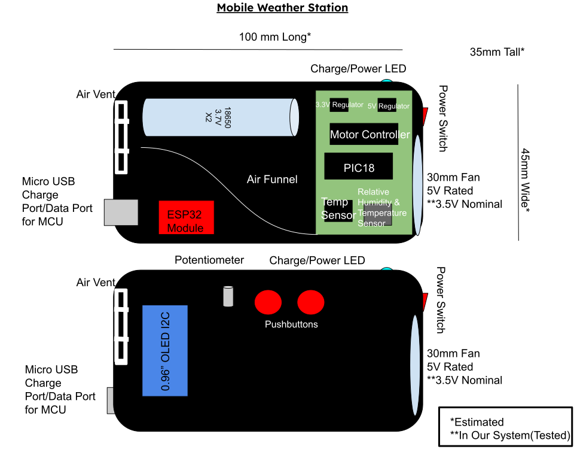
#### Figure 12 - Selected Design Sketch

This design is a redone version of the first design concept in the Design Ideation section. Apart from some required additions that were absent in the previous design sketch, this design got rid of the redundant sensors. This was initially supposed to help with calibration and accuracy by having the readings between the two sets of sensors compared and contrasted for a more precise reading. The coin cell batteries were replaced with the 3.7 V battery instead, as this kind of battery would last noticeably longer in this design. Lastly, a physical design element that was implemented over the original sketch is the inclusion of a wind tunnel. This would help in better directing the air drawn in from the fan actuator to help obtain readings and potentially cool the internal circuitry. All of these changes were made to better accomodate the electrical components selected for this design.

For the sake of clarity, here are a couple of screenshots of the 3D model that will serve as the enclosure for the circuitry.
.png "Enclosure (Isometric) 1")
#### Figure 13 - 3D Model Isometric 1

.png "Enclosure (Isometric) 2")
#### Figure 14 - 3D Model Isometric 2

The final product was designed around the models presented here. The potentiometer and charge/power LED were omitted from the final design, opting for just the couple of buttons for menu navigation. The wind tunnel was made straight to help with ease of internal design once the team had the final board designed and printed out. The board itself would result in taking up the entire bottom of the shell inside. The batteries would be mounted on the top portion of the shell to allow the internals to mesh well together when the shell is closed. Another addition would involve adding five male wire ends at the top to allow the microcontroller to be programmed with a PICkit. The wire ends protrude through the top half of the shell for easier access. Apart from small changes in orientation for some of the other components, this final product would essentially be the same as the design sketch above.

## Block Diagram

Once we developed our final project design concept, we then developed a block diagram to identify the individual subsystems needed to fulfill the project requirements and develop our project. We separated our design into five main subsystems: Power Supply subsystem, Microcontroller and OLED subsystem, Temperature Sensor subsystem, Humidity Sensor subsystem, and Motor Controller subsystem.

#### Figure 15 - Block Diagram

The Power Subsystem uses a switching voltage regulator to output 3.3V to supply power to the microcontroller, temperature sensor, and humidity sensor. The Microcontroller is an 8-bit microcontroller with MQTT, UART, PWM, SPI and I2C which fulfills project requirements. The Temperature sensor and Humidity sensor run on I2C protocol which fulfills one of the communication protocol requirements. The Motor Controller subsystem drives the motor using SPI communication protocol which fulfills project requirements. All components are surface-mount components and each pinout is labeled on the microcontroller block with their specific communication protocols.

&nbsp;

## Component Selection

With our block diagram laying the foundation for our design on a fundamental level, it was clear to find out exactly what would be required for this project to come to fruition. Having a general list of required components, we then went through a selection process to help us narrow down particular components available in the market. The ones listed here are the ones our team determined were the best option for our design. For the full list of components that our team selected from, please refer to [Appendix C - Component Selection](./Appendix-C.md) (For each component's product page, click the associated image).

### 5V Voltage Regulator

#### Table 2 - 5V Voltage Regulator

This IC is not much more expensive than the cheapest option, and is a big step up in the reputability of the manufacturer. We were initially going to go with option 1 because we are familiar with this chip as we used it in one of our ICC’s (the 3.3V version) but it was out of stock. We went with this alternative option because of its large stock.

### 3V Voltage Regulator

#### Table 3 - 3V Voltage Regulator

This IC is the cheapest option, and is a very reputable manufacturer. We also are familiar with this chip as we used it in one of our ICC’s (the 3.3V version). Worst case scenario we have to substitute it with the slightly more expensive and larger TI version.

### Humidity Sensor

#### Table 4 - Humidity Sensor
[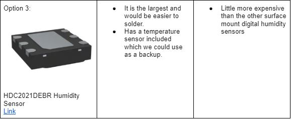](https://www.digikey.com/en/products/detail/texas-instruments/HDC2021DEBR/12762163?utm_adgroup=Sensors%20%26%20Transducers&utm_source=google&utm_medium=cpc&utm_campaign=Dynamic%20Search_EN_RLSA_Buyers&utm_term=&utm_content=Sensors%20%26%20Transducers&gclid=CjwKCAjwuqiiBhBtEiwATgvixL-BhjMrOFQl-A3NAmdco_Qin_fzEB-smklFNfIrEtE21yquz_f6IBoC-o0QAvD_BwE)

We needed a quick backup as our first option (the SHT40) did not function and was difficult to solder. This chip was much bigger and had better register and data information on the datasheet. We had working code for another I2C sensor from Texas Instruments so we assumed that would make it easier to code this chip.

### Temperature Sensor

### Table 5 - Temperature Sensor

Product was found on a reputable source and manufacturer. It is accurate and has a wide temperature-sensing range. It is the cheapest option and the benefits match the other more expensive sensors. The sensor runs on I2C protocol which will fulfill one of the communication protocol requirements as well. 

### Motor Driver

#### Table 6 - Motor Driver

It is the only part that was able to be found that would actually suffice for this project, as finding surface mount motor driver parts that are readily available and have serial communication capabilities are not easy to find online. This part was initially given out to the class, which will help in getting acquainted with the part’s behavior and obtaining help with getting the part to work. This part also comes with a datasheet for further information. This part will require an additional power rail but will serve our project’s purpose, nonetheless.

### Fan

#### Table 7 - Fan

The pricing for this device is the best out of all the options here, allowing for a couple more being available to order for spares. The listing for this product is also more reputable than some of the other options. This fan comes included with a datasheet and mounting screws, although the datasheet is not as detailed as Option 1’s. This product runs with 5V, and while it is larger than the other options with no RPM listed, it serves as a more efficient cooling fan that would best serve our project’s needs.

### Power Source

#### Table 8 - Power Source

The reason we went with the 3.7V batteries is because this would remove the need for a 5V switching regulator for our project. The 3.7V would be sufficient to run our motor driver and motor and then would be stepped down to 3.3V for our microcontroller and other components. We deemed this the best option and most cost effective taking into consideration the money we’ll save from cutting out the 5V switching regulator.

### OLED Display

#### Table 9 - OLED Display

The reason we went with option 1 was because of the price and the I2C protocol. We’ve been informed that the I2C protocol is easiest when coding an LCD screen. We also determined that our final product will be relatively small so the small size of the OLED will be perfect for our device.

### Power Budget

Gathering the information provided by each component's datasheet and additionally provided information, the power budget was able to be created to give the team insight on how much power the overall system consumed. Below are the calculations made to determine the available current and its use in the entire system of our design.

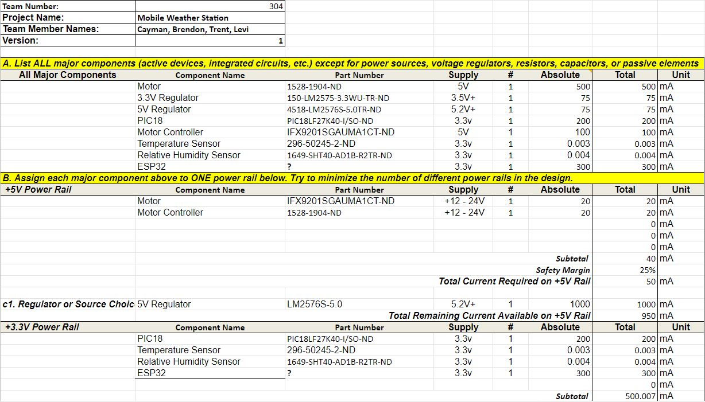
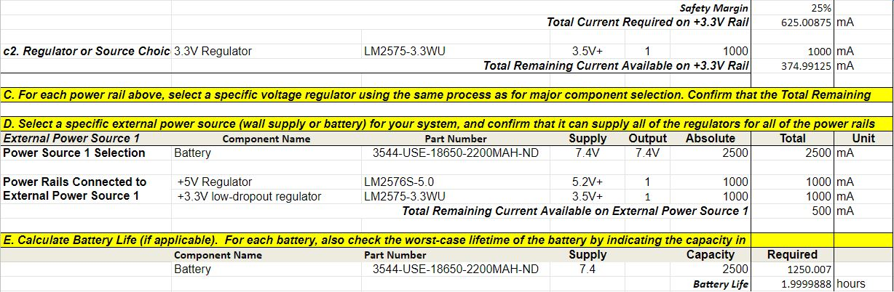
#### Figure 16 - Power Budget

There are eight major components involved that draw power from the power subsystem. Out of all of them, it seems the two digital sensors draw a minute amount of current; just a few microamps each. On the opposite side of the spectrum, the motor draws the most. The associated motor controller draws only one-fifth of that current. The ESP32 module would take up 300 mA with the PIC itself following at 200 mA. Lastly, the voltage regulators for the 3.3 V and 5 V rails would consume 75 mA. It was important to know how this would all affect our project's functionality, so the template was able to calculate the current available for us. We would enter the values found for each of these components involved in the power subsystem into the template, and the remaining current would be given. This also helped us determine how efficient different battery selections would be for this design along with how long they would last if left continuously running.

&nbsp;

## Microcontroller Selection

In order to narrow down the vast pool of 8 bit microcontrollers, we first identified our specific product's requirements. We referred to the block diagram created earlier to get a pin count of the list of capabilites we would need to look for in an MCU. This included I2C peripherals, for our temperature and humidity sensors, an SPI peripheral for the fan motor driver motor driver, and a UART peripheral for communication with an ESP32 board. 

Next, we used the Microchip Parametric Search Tool to search for 8 bit microcontrollers that met, at a minimum all of our project-specific requirements. We referenced the datasheet to collect specs on each microcontroller, then put them into a table for evaluation. A copy of the table is below.

#### Table 10 - Microcontroller Selection

At first, we had little idea what to look for in a microcontroller, and even less understanding of how to find it. The naming convention for the myriad of different products was confusing and the language and format of the datasheets obtuse. However, by going through exercise of filling out the table multiple times for different MCUs, we felt we became much more comfortable and competent. Finally, we were able to make a final choice, based on the data we had collected, of the microcontroller that was optimal for our project. This decision was reached collaboratively by our team through the iterative process of researching, evaluating, and rating different microcontrollers as our understanding of the task at hand deepened. 

 The first MCU we researched was essentially randomly chosen - of the several dozen chips that could meet our project requirements, we just happened to select the [PIC18F45J10](https://www.microchip.com/en-us/product/PIC18F44J10). This was our first experience combing through microchip datasheets, and so we felt we wanted to get a little more experience. Since the PIC18F45J10 was rather small and minimal, the next chip we analyzed was at the other end of the spectrum. We chose the hugely powerful [PIC18F67K40](https://www.microchip.com/en-us/product/PIC18F67K40). This behemoth had the capability to everything our projcet required, five times over. We ultimately decided that it was too much. The final product, the [PIC18LF27K40](https://www.microchip.com/en-us/product/PIC18F27K40#), hit the goldilocks zone for us. It had all of the required peripherals and just a few extra pins, in a reasonably sized package. However, one thing that really sold us on the PIC18LF27K40 was its ability to remap peripherals onto many pins. This would allow us lots of flexibility with our pin mapping and potential solutions to any mistakes made. We also verifiend it was compatible with MCC and MPLAB X IDE. We ended up choosing the PIC18LF27K40 as our final MCU choice.

 
#### Figure 17 - PIC18F27K40

&nbsp;

## Software Implementation

&nbsp;

In order to model and lay out the overall framework and architecture of the code required to run our product, our team created an activity diagram. The goal of the diagram was not necessarily to write any functional code, but to establish the overall functionality of our software. We did so by creating a UML state chart mapping the intended flow of our program. 

&nbsp;

### Software Implementation UML Activity Diagram
[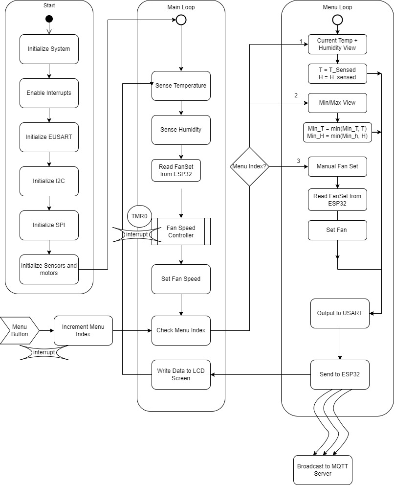](./images/design-ideation-images/Software_Diagram_Final.pdf "Software Implementation UML Activity Diagram")
#### Figure 18 - Software Diagram

[Click the diagram image for PDF view]

### Functionality

Our program will begin with the initialization of necessary peripherals, including EUSART, I²C, and SPI. The initialization functions will run only once, at the beginning of the program. Next, we will enter the main loop of the program.

Within the main loop of the program, the PIC MCU will repeatedly execute a set of instructions. First, it will utilize the I2C protocol to acquire data from the temperature and humidity sensors. Next, it will analyze the data gathered from the sensors and make a determination as to what speed the fan should operate at. This decision is based on the temperature and humidity readings. After deciding on the appropriate fan speed, the PIC MCU will transmit this information over the SPI protocol to the motor, which controls the fan's rotational speed. Finally, the PIC MCU will take into account the current menu setting and utilize the USART protocol to send the appropriate data to the LED screen. The data displayed on the LED screen is based on the settings that have been selected by the user. This entire process is continuously repeated in a loop, allowing for the system to consistently monitor and adjust the temperature and humidity levels as necessary.

If, at any point during the main loop, the menu button is pressed, an interrupt is triggered and the program enters the menu subloop. The menu index is incremented, which determines the current mode of operation within the menu subloop. The menu subloop has been designed to provide the user with various options for interacting with the system.

In mode 1, the program simply displays the current temperature and humidity values. This allows the user to monitor the current state of the system without making any changes.

In mode 2, the program displays the maximum temperature and humidity recorded in the current session. This requires the program to keep track of the highest temperature and humidity readings received since the session started. To accomplish this, the program continuously compares the highest recorded temperature and humidity values with the current readings and updates the maximum values as necessary.

In mode 3, the user can calibrate the system by entering known temperature and humidity values. The program then calculates the difference between the measured and input values and saves this difference as an offset to be applied to all future readings. This allows the system to be adjusted to account for any discrepancies in the sensors or other environmental factors. 

By providing these different modes of operation, the program allows for greater flexibility and customization of the system. Additionally, the use of interrupts and menu indexing provides a user-friendly interface that allows for easy navigation and control of the system.

### Rationale

Our team carefully considered the suite of features that our hardware could theoretically be used for and aimed to provide as many features as possible with a simple and understandable user interface. The main loop of the program was designed to continuously read data from the temperature and humidity sensors, process that data to adjust the fan's speed, output data over SPI to the motor, and transmit selected data over USART to the LED screen. This was done to ensure that the system was constantly monitoring and adjusting to changes in temperature and humidity, and that users could easily see the current readings on the LED screen. The menu subloop was implemented to provide users with a way to access and customize different settings on the product, so as to increase the product's flexibility and user-friendliness. The three different modes of the menu system were designed to provide users with different options based on their needs, such as viewing current or historical weather data. Calibration of the device was deemed a necessary option to ensure that users could trust the data provided by the system and make informed decisions based on that data. We also wanted the user interface to be simple, intuitive, and responsive. To make the product more user-friendly and accessible to a wider range of users, we wanted the menu system to be easy to navigate and understand.

The diagram here depicts how the user needs and product requirements are fulfilled. It outlines the ability to measure humidity and temperature, sensing the environment around it. The separate menus provide multiple functionalities while consuming low amounts of power. A high duty-cycle can be used while operating the device's fan. The sensors and flow of operation allow for consistent readings that people can see easily with a backlit display. Digital graphs can be provided through the use of the ESP32 and the independent MQTT server, making it very useful for users to obtain relevant information and see the trends within the data. Being connected through Wi-Fi enables the device to obtain time and date information if so desired.

For more information regarding the MQTT topics and the user-designed code used to run the device, refer to [Appendix E - MQTT Topic Table & Code](./Appendix-E.md)

### Top 5 Software Changes

1. Push button for menu system uses interrupt. Since our main loop has several wait statements, which block other code execution, we found that pressing the menu button was hit or miss in regards to actually incrementing the menu index. The solution to this was to set up the pin to interrupt on change. We also included a debounce function in the interrupt handler callback function.

2. Menu system simplified to a welcome screen and a current sensor measurements screen. This was mainly due to time pressure to turn in a minimum viable product. The max and min temperature view was removed, since the topic history and graph is available on the MQTT Explorer app. We also removed the ability to add an offset to the temperature and humidity readings, due to the complexity of such a feature.

3. The menu system is handled via Python code in the ESP32, instead of on the PIC as originally planned. This change simplified the menu implementation, as the only effect the menu system has is displaying data to the OLED, which is already handled in the ESP32. 

4. We are now publishing on multiple topics(Temperature, Humidity, FanSpeed, and Menu) instead of just one topic (TempHum) with all the data combined. This simplified data parsing and debugging, and was not difficult to implement. Additionally, since the messages published to MQTT are now number data types, not strings or arrays, a graph of each message value can be viewed in the MQTT Explorer app.

5. No longer recording max and min temperatures and humidities. The necessity to compare each value from the sensor readings with the historical maximum and minimum values was removed due to the omission of the max/min view feature.

### Software Version 2.0

If we had more time to make improvements to our software, it would've been to implement the original menus to help with obtaining max and min values of the temperature and humidity readings. It also would've allowed the user to manually set the fan directly from the device instead of just setting it through the server. Having multiple menus would also warrant the use of both buttons as originally intended. Being able to offset the readings of the humidity and temperature sensors would also be ideal to calibrate the device if necessary. By the time of the showcase, the device was operating, although in a delicate fashion; a power cycle could throw off the functionality and can be finicky to get working again. Having more time, we would've explored the reasoning behind this to correct that error, stabilize its performance, and be more comfortable with enclosing the entire project in its shell. 

&nbsp;

## Hardware Implementation

With all of the components selected for the project, the next step was to put them all together in a complete and comprehensive schematic. The schematic was split into parts to clearly depict the different subsystems involved.

[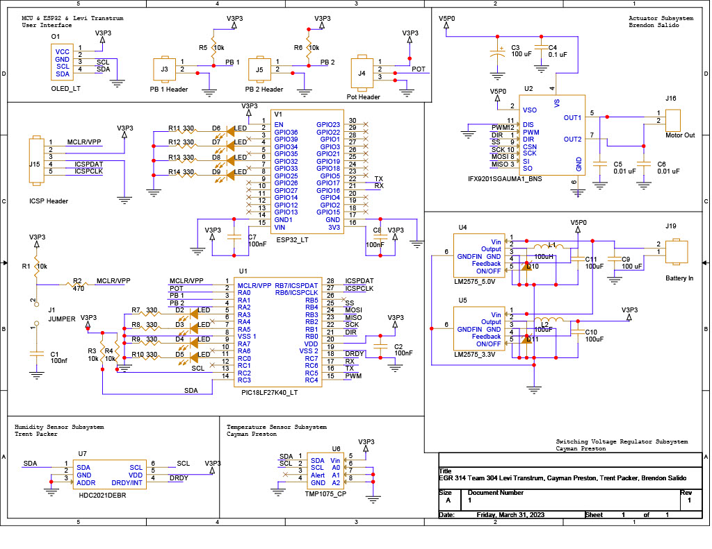](./images/design-ideation-images/TEAM304FINALSCHEMATIC.pdf "Hardware Implementation")
#### Figure 19 - Project Schematic

[Click the schematic image for PDF view]

We begin by looking at the PIC18 component, the microprocessor that will run the entirety of the design. It is here where the sensors, actuator, buttons, display, potentiometer, and ESP32 module will operate from. The sensors depicted here utilize the I2C communication protocol while the motor controller uses the SPI communication protocol, satisfying the project's requirements thus far. There would also be an ESP32 module which would serve as the means for data exchange via bluetooth; another requirement satisfied. The combined components of the OLED display, pushbuttons and potentiometer wouldn't count towards the project's required subsystems, but would prove beneficial and important to the overall function of this project. The power subsystem would work under a switching voltage regulator setup between a 3.3 V and 5 V regulator setup to provide to the other subsystems, all hooked up to a couple of 3.7 V batteries for power.

After the schematic was finalized, we created our team PCB design of the schematic.

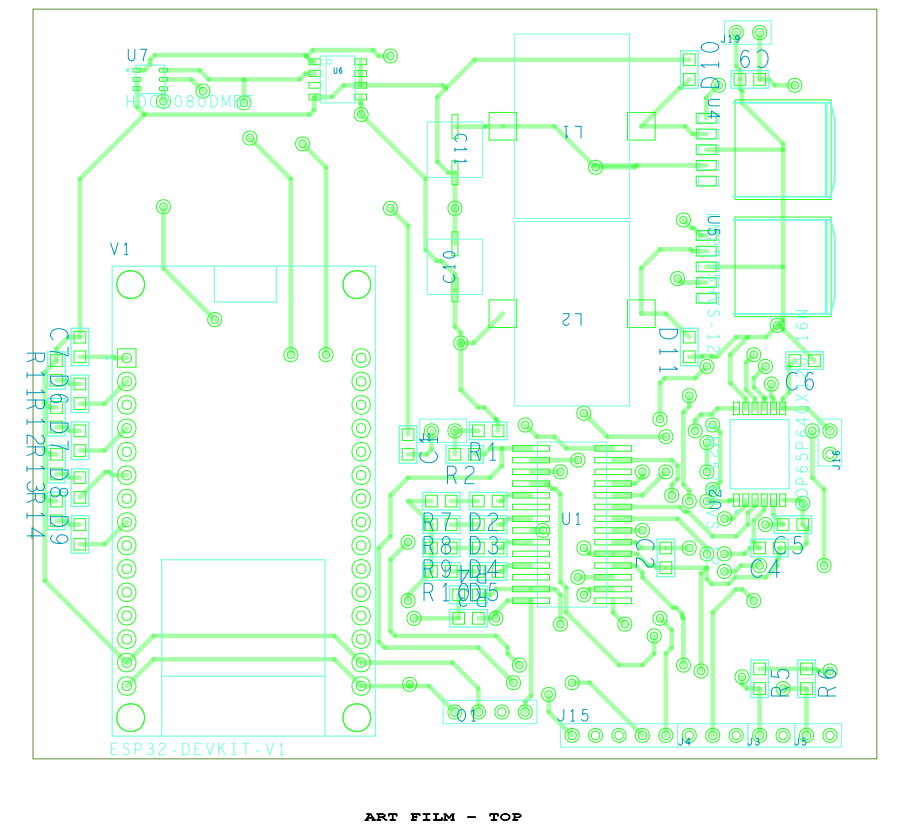
#### Figure 20 - Top PCB Design

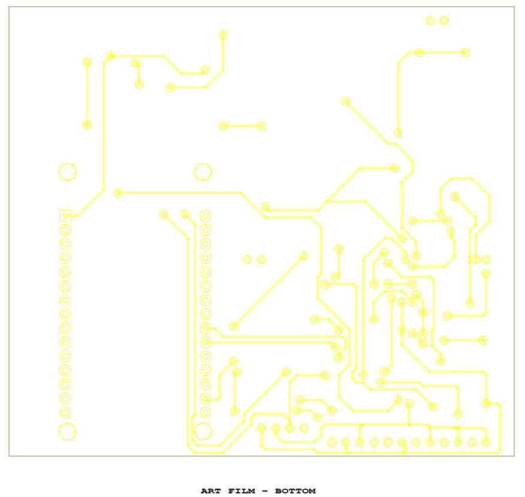
#### Figure 21 - Bottom PCB Design

This is what team's PCB looked like after being manufactured and assembled.

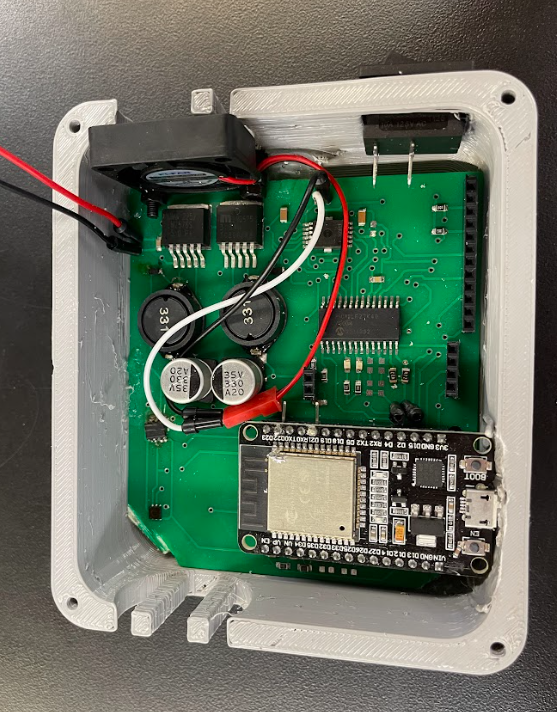
#### Figure 22 - Top Physical PCB

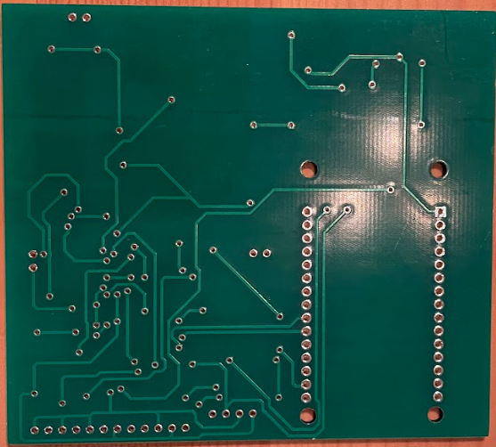
#### Figure 23 - Bottom Physical PCB

Our schematic and final design fulfills almost all of the user needs and requirements. The board runs on two rechargeable 3.7 Lithium Ion batteries in series which combined provide 7.4V of power. We then step the voltage down to 5V to run the motor and down to 3.3V to run the PIC, temperature sensor, humidity sensor, OLED, and ESP32 module. The two batteries combined provide an excellent power source with good battery longevity.
Our design provides a user-friendly interface with a menu system. In the menu, the user will have access to multiple functions such as the current humidity and temperature readings, the max and minimum humidity and temperature readings, and an option to set the motor fan speed. The fan does an excellent job of cooling down the internal electrical components when it gets too hot which allows the device to function in a wide range of climate conditions. There is also a grill in front of the fan to provide protection from anything that could damage the motor.
The sensors are extremely compact and are the two smallest IC’s on the entire board. They provide a compact and sleek design for the PCB and provide more room for the larger components on the board. This helped to decrease the overall size of the board and reduce the size of our device overall to provide a sleek hand held design and look. The sensors read and output data to the PIC effectively and have options to offset the data readings in case of any error. We assume that error will slowly accumulate as the device ages so it is important that the sensors have these features to adjust them as necessary so they continue to provide accurate readings even with age.

The PIC microcontroller does an excellent job of meeting the project needs. It is very power efficient and overall, the device has minimal power requirements. The PIC provides multiple menu functions and informs the user of the humidity and temperature readings.
In summary, the device is sleek, hand held, light weight, transportable, durable and has a solid enclosure. It meets our project requirements, user requirements and meets our personal expectations for the project. 

For the bill of materials of this design, please refer to [Appendix D - Bill of Materials](./Appendix-D.md).

### Hardware Version 2.0

Two areas that will need improvement are the traces for the motor driver and the temperature sensor. There was an error on the board where the DIR pin was tied to 5V and pulled high. This limited our ability to change the direction of the motor. In our application, the motor only needed to spin one way so this wasn’t a major drawback for our final design. Another error we discovered is that there was an error on the board where the temperature sensor traces were not connected correctly to the PIC or to power. This shorted the sensor so in the future we will need to revise the footprint and trace pathing for the temperature sensor. Another area we could improve is providing more space for terminal blocks to tie in power and the motor leads. The terminal blocks we are currently using hang over the PCB and squish the top of some of the surface mount parts. We ended up removing them and soldering jumpers to the board but in the future, we would design the board to provide more space to solder on terminal boxes. Last but not least, we had already designed the OLED to connect directly to our microcontroller before we performed the OLED ESP32 ICC. In the future, we will design the OLED to connect to the ESP32 directly. We ended up having to solder jumpers to the header pins for the ESP32 module which functions for now but we will update the board in the future.

## System Verification

By the conclusion of the project, the team was able to verify functionality of every subsystem minus the temperature sensor. Due to time constraints, the temperature sensor was unable to be replaced, but this was remedied using the double functionality of the humidity sensor which could also measure temperature. Through this, the team was still able to obtain both temperature and humidity readings for the project. After every subsystem was reviewed, this is what the verification table yielded for the team.
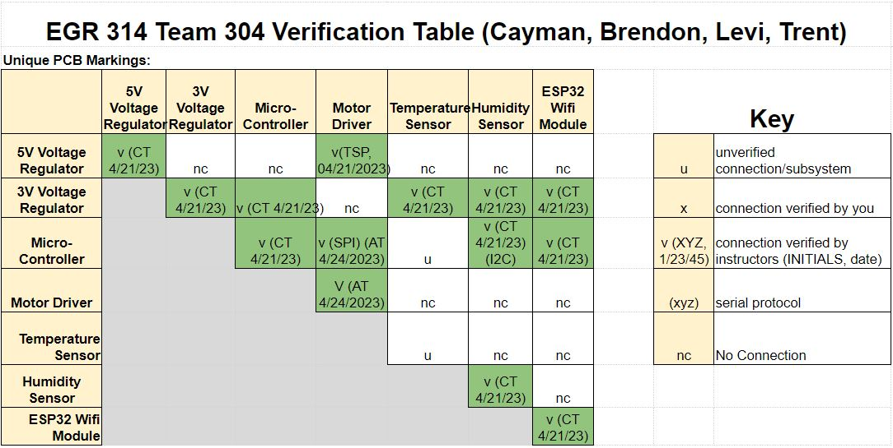
#### Figure 24 - Verification Table

## Lessons Learned

- The time it takes to include a generous amount of test points for debugging overtakes the time to add them during the PCB/schematic designing.

- Being acquainted with reading dimensions on datasheets for surface mount parts is essential to ensure proper footprint designs and correctly manufactured PCBs.

- To prevent the failure of commits and loss of the overwritten version, pull requests were emphasized while working on the same repository.

- Always verify the information you receive. We were putting our board through the oven and the temperature was set wrong and the solder paste wasn’t reflowing correctly.

- Design circuits around the datasheet. Usually if it has it on there it is important. We figured that the diodes on the switching power regulator were safety precautions for backflow current but it ended up being an important factor of the regulator functionality.

- Do not take a single person’s word as Gospel for a design change; it is more beneficial to obtain multiple perspectives on the same topic to make a better informed decision.

- Take note when a provided example schematic on a datasheet says it is not guaranteed to function correctly. Test it to determine what changes it may require before moving forward with it.

- Do not commit to a circuit subsystem on a PCB without knowing that it works. Rerouting traces on a manufactured board is significantly more difficult than redesigning it with a working schematic beforehand.

- Having a design review really helped in spotting specific issues within the various facets of the project. The feedback received from the review assisted in finding several flaws that would have hindered or prevented functionality of the project.

- We learned the importance of in-depth peer reviews. We didn’t do very in-depth peer reviews of our final team PCB and we discovered a few errors at the last minute that resulted in one of our subsystems not even working and a second that had half functionality. Do as much in depth peer review as possible.

## Recommendations for Future Students

1. When working with Cadence, look at all of the articles provided with the Cadence tag. It will take significantly less time to read through them than to correct mistakes post-design.

2. If your coding abilities are rusty, especially in C, it will benefit you immensely to get a refresher for the homework and ICCs.

3. If you are unable to get a full checkoff, even if it is late, it is better to get a small portion of points than none at all. With the amount of points available in this course, missing them does add up over time.

4. Peer review each other's schematics and PCB designs. We rushed through our schematic and PCB reviews and were caught on the file board with a couple trace and footprint errors. The more in-depth peer reviews the better.

5. When presenting to reviewers, professors, classmates, and anyone else, provide as many visuals and accessibility as possible. Clicking figures that redirect someone to a full pdf or high resolution image are very helpful when reviewing reports. Providing QR codes to websites and team reports are extremely helpful in order to avoid having to read and type in URL links.

&nbsp;

&nbsp;

[Back to top](#top)
