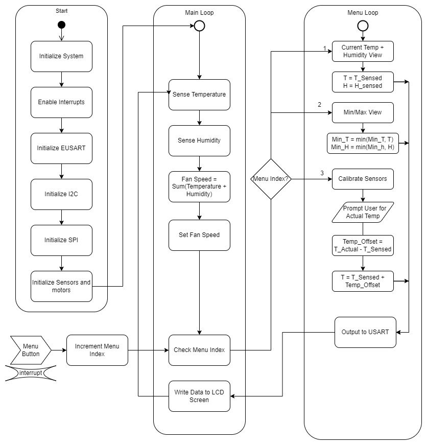

[< Back to home](./index.md)
<h1>Team Report</h1>

&nbsp;

## Table of Contents

[Team Organization](https://egr314-team-304.github.io/team-report.html#team-organization)

- [Establishing the Team](https://egr314-team-304.github.io/team-report.html#establishing-the-team)
- [Charter](https://egr314-team-304.github.io/team-report.html#charter)
- [Product Mission Statement](https://egr314-team-304.github.io/team-report.html#product-mission-statement)

[User Needs, Benchmarking, and Requirements](https://egr314-team-304.github.io/team-report.html#user-needs-benchmarking-and-requirements)

- [Objectives](https://egr314-team-304.github.io/team-report.html#objectives)
- [Stakeholders](https://egr314-team-304.github.io/team-report.html#stakeholders)
- [Use Cases](https://egr314-team-304.github.io/team-report.html#use-cases)
- [User Needs](https://egr314-team-304.github.io/team-report.html#user-needs)
- [Aspects](https://egr314-team-304.github.io/team-report.html#aspects)
- [Open Questions](https://egr314-team-304.github.io/team-report.html#open-questions)
- [Milestones](https://egr314-team-304.github.io/team-report.html#milestones)

[Design Ideation](https://egr314-team-304.github.io/team-report.html#design-ideation)

- [Brainstorming Ideas](https://egr314-team-304.github.io/team-report.html#brainstorming-ideas)
- [Grouped and Sorted Ideas](https://egr314-team-304.github.io/team-report.html#grouped-and-sorted-ideas)
- [Product Concept Sketch #1 - Dynamic Remote Weather Station](https://egr314-team-304.github.io/team-report.html#product-concept-sketch-1---dynamic-remote-weather-station)
- [Product Concept Sketch #2 - Handheld Weather Station](https://egr314-team-304.github.io/team-report.html#product-concept-sketch-2---handheld-weather-station)
- [Product Concept Sketch #3 - Automatic Plant Hydrator](https://egr314-team-304.github.io/team-report.html#product-concept-sketch-3---automatic-plant-hydrator)

[Block Diagram](https://egr314-team-304.github.io/team-report.html#block-diagram)

[Component Selection](https://egr314-team-304.github.io/team-report.html#component-selection)

- [5V Voltage Regulator](https://egr314-team-304.github.io/team-report.html#5v-voltage-regulator)
- [3V Voltage Regulator](https://egr314-team-304.github.io/team-report.html#3v-voltage-regulator)
- [Humidity Sensor](https://egr314-team-304.github.io/team-report.html#humidity-sensor)
- [Temperature Sensor](https://egr314-team-304.github.io/team-report.html#temperature-sensor)
- [Motor Driver](https://egr314-team-304.github.io/team-report.html#motor-driver)
- [Fan](https://egr314-team-304.github.io/team-report.html#fan)
- [Power Source](https://egr314-team-304.github.io/team-report.html#power-source)
- [OLED Display](https://egr314-team-304.github.io/team-report.html#oled-display)
- [Power Budget](https://egr314-team-304.github.io/team-report.html#power-budget)

[Microcontroller Selection](https://egr314-team-304.github.io/team-report.html#microcontroller-selection)

[Software Proposal](https://egr314-team-304.github.io/team-report.html#software-proposal)

- [Software Proposal UML Activity Diagram](https://egr314-team-304.github.io/team-report.html#software-proposal-uml-activity-diagram)
- [Functionality](https://egr314-team-304.github.io/team-report.html#functionality)
- [Rationale](https://egr314-team-304.github.io/team-report.html#rationale)

[Hardware Proposal](https://egr314-team-304.github.io/team-report.html#hardware-proposal)

&nbsp;

## Team Organization

### Establishing the Team

Upon establishing our team, we began discussing what our individual expectations were for this project. We immediately agreed that we wanted our design to stand out above the rest of the groups in both sections. With that in mind, we began forming goals that would help us develop our current knowledge and be successful in or primary objective. First, we want to create a final product that is a functioning and independent device that can perform in the Innovation Showcase. Second, we want to utilize and develop each team member’s knowledge and skills in embedded systems design. Third, we want to obtain a greater understanding of serial protocol communication, the different types of serial protocols available, and how they can function in unison within the application of our product. Fourth, we want to create a robust and reliable electrical design that is as close to a sellable product as possible. Fifth, we want to design and build a product that we can add to each of our resumes.

After establishing these goals, we developed the following Team Charter and Mission Statement: 

&nbsp;

### Charter

> *“Our team will work together to harness each of our collective abilities and experience to bring a robust and reliable product to the Innovation Showcase that we are proud of, can attract interest from viewers and employers, and can be worthy enough of recognition to add to our own resumes.”*  
&nbsp;

### Product Mission Statement

> *“To leverage each of our team member’s areas of expertise to design and build a reliable, attractive, and functional weather station with a small form factor. The product will solve a real world environmental problem using sensors and actuators. Our product will be similar in quality to commercially available, professionally designed products.”*  
&nbsp;

See [Appendix A](./Appendix-A.md) for further Team Organization content.

&nbsp;

## User Needs, Benchmarking, and Requirements

### Introduction

Portable weather stations are used in a wide variety of applications. Some use them for personal applications such as in residential homes and farmlands to predict weather conditions. Others use them for more critical applications such as emergency responders conducting hazard analysis to run more accurate tests on the weather to guide them in decisions regarding public safety. These devices are in high demand and are always in need of being improved while minimizing the cost for both personal and emergency applications. Users describe difficulty with the longevity of the batteries, the accuracy of sensors, the range of applications, and the wireless connectivity of devices.   

&nbsp;

### Objectives

The aim for this project is to design and build a reliable, attractive, and functional weather station with a small form factor. The product will be similar in quality to commercially available, professionally designed products and that are financially available for all users. The product will solve real world environmental problems while improving on the accuracy and range of serial sensors such as temperature, humidity, atmospheric pressure, and wind speed sensors. As a team, the objective is to create a mobile weather station that stands out against the other project teams and competes with the devices currently available. Our main competitors will be the handheld anemometer by Intendvision, the Kestrel 3000 pocket weather meter, the HODIK weather station, the La Crosse Personal Weather Station, and the Netatmo weather station. Based on the user feedback from the devices of our competitors, we will aim to increase the longevity of the battery life of these devices, the accuracy of the temperature and other serial sensors, integrate more sensing options, and improve the wireless connection between devices.

&nbsp;

### Stakeholders
- Target group: Middle-income individuals who are avid nature fans or who have active outdoor hobbies.
- Target purchaser: Target group profile with special attention to Full Nest I and Full Nest II mothers.
- Customer service: Prefers easy-to-repair, cheap to replace, and simple to use product.
- Marketing & Sales division: Looks for unique selling points that distinguishes our product from countless competitors on the market.
- Retailers: Prefer products that can withstand a wide range of storage conditions including variations in temperature, vibration, humidity, and atmospheric pressure, and have a strong and compact, theft, and vandalism-proof packaging.
- Regulatory instances: The product needs to comply with CE guidelines in Europe, including 2014/53/EU, 2011/65/EU, and 2009/125/EC as well as RoHS: EN50581:2012, FCC Rules part 15 ID BCG-A2083 and BCG-A2084 for the United States, Canada IC numbers 579C-A2083 and 579C-A2084, TP TC 020/2011 for Russia, Mexico NOM conformity to A2083, A2084, and A2083, Turkey’s AEEE compliance, Japan VCCI codes 003-190159, D190123003, 003-190158, and D190122003, Singapore IMDA DB00063, and Malaysia MCMC-CIDF15000007.

&nbsp;

### Use Cases

We envision our product being used by everyday people with an interest in the weather, such as the people described in the following stories.

#### **John**
> John is a 68-year-old man who has a small garden in his backyard where he grows vegetables. He has been gardening for many years and takes great pride in his crops. However, in recent years, he has been facing a problem with weather events destroying his plants. He would often come home to find his garden flooded or his plants wilted due to extreme heat. Determined to save his crops, John decided to invest in a weather station. The weather station senses and reports weather conditions such as temperature, humidity, and precipitation. With this information, John is able to take the necessary precautions to protect his garden from the elements. He sets up a watering system to protect his plants from the heat and a drainage system to prevent flooding. He also sets up a small greenhouse to protect his plants from frost. Thanks to the weather station, John is able to save his crops and continue enjoying the fruits of his labor.  

#### **Samantha** 
> Samantha is a 12-year-old girl who has always been fascinated by the weather. She would often spend her free time pretending to be a news weather anchor, giving forecasts to her family and friends. However, her pretend forecasts were based on guesses rather than actual data. She always wished she had some real equipment to help her understand the weather better. For her birthday one year, Samantha's parents surprised her with a weather station. The weather station can sense temperature and precipitation, and it was just what she needed to start her own weather observations. She set it up in the backyard and started tracking the weather patterns in her area. The data she collected was fascinating and helped her to understand the weather better. This made her even more determined to study to become a meteorologist. She would spend hours studying the data and learning more about the atmosphere. The weather station was her first step in becoming a real meteorologist, and she was so excited to see where it would take her.  

#### **Keith**
> Keith is an avid hunter. His favorite game to hunt is Elk. He typically goes up to Coconino National Forest to hunt some. However, he has noticed that the online weather results are not nearly as accurate as they claim to be. He did some research and found the Weather Station by Team 304 and was immediately impressed. He is able to set up several devices due to their affordability. They are light and compact so he can bring many out to the large area he hunts in, without weighing him down. But most importantly, he is able to get much more accurate local weather data, which is pivotal for his big game hunt.
&nbsp;

### User Needs

Our team employed a comprehensive methodology to identify and prioritize user needs for our product. We first examined reviews of competing products and observed the pros and cons of existing products to gain a deeper understanding of what customers liked and didn't like. This information was then translated into a list of needs for our product. Our team identified the following needs:

> 1. Device should withstand weather conditions.   
> 1. The device must display the information it collects.   
> 1. Device should function reliably for up to 2-3 years.   
> 1. Device electronics should be protected from moisture as much as possible.   
> 1. The device needs good quality material for its build.   
> 1. The product must run for a long time without maintenance.   
> 1. Have a mounting feature.   
> 1. The product must be reliable.   
> 1. Should be able to run on batteries.   
> 1. Should be ergonomically friendly.   
> 1. Should be compact.   
> 1. Display should be easy to read.   
> 1. The product must indicate its current state to the user.   
> 1. Battery life should be long lasting.   
> 1. The product's design must not attempt to prevent the user from using it for their desired purpose.   
> 1. Device should employ a method to clip or attach it to something for carrying purposes to reduce likelihood of losing it.   
> 1. Device is low weight, making it easy to carry.   
> 1. The physical build of the device needs to utilize the inner space as efficiently as possible and minimizes empty space inside.   
> 1. The product must provide accurate information.   
> 1. Have a wide temperature range for all climates.   
> 1. Should be hand held.   
> 1. Device must have reliable battery system.   
> 1. Device must measure humidity.   
> 1. Device sensors must be accurate.   
> 1. The device must sense the environment.   
> 1. The product must be reliable.   
> 1. Device must have reliable results/readings.  
> 1. Device has multiple functionalities.   
> 1. Device could benefit from having the ability to calibrate it.   
> 1. The product must be low-power.   
> 1. Needs to have replaceable sensors.   
> 1. Sensors should be cheap to replace.   
> 1. Device should have safeguards in place to prevent picking up noise from readings while in use.   
> 1. Device must support a very high duty cycle.   
> 1. Readings are consistent.   
> 1. Device must have reliable hardware.   
> 1. The product must include basic features of an electronic device that all users will expect.   
> 1. Readings from device are made easier to see with backlit display; use at night, dark places and bright areas are possible.   
> 1. Device should have a way to attach it to another surface or prop to minimize noisy readings.   
> 1. The product must have a short set-up time.   
> 1. Device must give customer informed insights.   
> 1. Needs a manual adjuster to calibrate sensors.   
> 1. Needs a debugging function to test functionality of sensors.   
> 1. Device must give users un-observable data.   
> 1. Device must be beneficial to customers knowledge of their environment.   
> 1. The product must behave in an intuitive, easy-to-understand way.   
> 1. Device must have notification abilities.  
> 1. Device offers a means to digitally graph readings through provided software.   
> 1. The product must have a clear user interface.   
> 1. Device must inform users of results.   
> 1. User input for settings ought to be saved upon power down for ease of use.   
> 1. The product must not incorporate features which the user has to ‘work around’ to do what they want.   
> 1. Device display needs to be focused on its purpose with minimal other distractions.   
> 1. Device must update frequently.   
> 1. Auto-shutoff features should be configurable within the device.   
> 1. Indoor unit and outdoor unit need to have a strong connective signal for consistent readings.   
> 1. Display should have adjustable brightness.   
> 1. Display should have a manual sleep mode to turn the mode on and off when desired.   
> 1. Needs a function to set day and time.   
> 1. Device could benefit from having a zero-ing feature to minimize noisy readings from using it in close proximity.   
> 1. The product must respond to user inputs in real time.   
> 1. The device must be easy to use.   
> 1. Device needs to respond easily.  
> 1. The product must not require frequent reboots.   
> 1. Device must have independent “server”.   
> 1. Device should be affordable, in terms of construction and delivery.   
> 1. The product’s documentation must be clear enough to understand the first time.   
> 1. Fast customer service.   
> 1. Device offers a feature that more affordable alternatives do not offer.   
> 1. The product must be affordable to own and maintain, not just to purchase.   

In order to effectively organize and prioritize these needs, we assigned them to five categories: Mechanical, Electronic, Software, Back End, and Other. This categorization allowed for clear and efficient communication and reasoning within our team as we worked to rank the needs by priority. The importance of each need was determined through a collaborative process on [**this Google Jamboard**](https://jamboard.google.com/d/1In28mVD_horjKMaDQrNpOpYlQ2rOk_49XHPvBdQrUTo/edit?usp=sharing), where the team discussed over voice chat and assigned weights to the needs based on their perceived impact on the overall user experience. Screenshots of each step of this process can be found in [Appendix B](./Appendix-B.md).

&nbsp;

### Aspects 
We then extracted meaning from the user needs by carefully analyzing the information gathered from reviews of similar products and observing the pros and cons of existing products. This allowed us to identify the key features and functionality that customers valued in similar products. We then translated these user needs into a list of product requirements that would ensure that our product met each of the most important user needs. To ensure that our product met these requirements, we prioritized the most important user needs and assigned them a specific requirement for our product. This process involved breaking down the user needs into smaller, more specific components and outlining the necessary steps to meet each one. Additionally, we continuously reviewed and refined the list of requirements throughout the development process to ensure that they remained aligned with the evolving needs of our target market.  

We outlined the following major design aspects for our product.

> 1. **Hardware / Product Design**
>     1.  The product must be able to withstand various weather conditions. 
>     2.  The product must display the information it collects. 
>     3.  The product must function reliably for up to 2-3 years. 
>     4.  The product must have measures in place to protect its electronics from moisture. 
>     5.  The product must be made with high-quality materials for its construction. 
>     6.  The product must be able to run for a long time without requiring maintenance. 
>     7.  The product must have a mounting feature.
>     8.  The product must be reliable. 
>     9.  The product must be able to run on batteries.
>     10. The product must be ergonomically designed for comfort and ease of use. 
>     11. The product must be compact in size. 
>     12. The product's display must be easy to read. 
>     13. The product must clearly indicate its current state to the user. 
>     14. The product must have long-lasting battery life. 
>     15. The product's design must not restrict or limit the user's desired use of the device. 
>     16. The product must have a method for attaching or clipping it to something for easy carrying and to reduce the likelihood of losing it. 
>     17. The product must be lightweight and easy to carry. 
>     18. The product must efficiently utilize the internal space and minimize empty space inside.
>     19. The product must provide accurate information. 
>     20. The product must be able to operate in a wide range of temperatures and climates. 
>     21. The product must be designed to be held in the hand.
> 2. **Software / Functionality**
>     1. The product must measure humidity.
>     2. The product must have accurate sensors.
>     3. The product must sense the environment.
>     4. The product must be reliable.
>     5. The product must have reliable results/readings.
>     6. The product must have multiple functionalities.
>     7. The product must have the ability to calibrate it.
>     8. The product must have low-power consumption.
>     9. The product must have replaceable sensors.
>     10. The product must have sensors that are cheap to replace.
>     11. The product must have safeguards in place to prevent picking up noise from readings while in use.
>     12. The product must support a very high duty cycle.
>     13. The product must have consistent readings.
>     14. The product must have reliable hardware.
>     15. The product must include basic features of an electronic device that all users will expect.
>     16. The product must have a backlit display to make readings easier to see in low light conditions.
>     17. The product’s sensors must have a way to attach it to another surface or prop to minimize noisy readings.
> 3. **Interactivity & User Experience**
>     1. The product must have a short set-up time.
>     2. The product must give customers informed insights.
>     3. The product must have a manual adjuster to calibrate sensors.
>     4. The product must have a debugging function to test the functionality of sensors.
>     5. The product must give users unobservable data.
>     6. The product must be beneficial to customers' knowledge of their environment.
>     7. The product must behave in an intuitive, easy-to-understand way.
>     8. The product must have notification abilities.
>     9. The product must offer a means to digitally graph readings through provided software.
>     10. The product must have a clear user interface.
>     11. The product must inform users of results.
>     12. The product must save user input for settings upon power down for ease of use.
>     13. The product must not incorporate features which the user has to 'work around' to do what they want.
>     14. The product must have a display that is focused on its purpose with minimal other distractions.
>     15. The product must update frequently.
>     16. The product must have configurable auto-shutoff features.
>     17. The product must have a strong connective signal between the indoor unit and outdoor unit for consistent readings.
>     18. The product must have an adjustable display brightness.
>     19. The product must have a manual sleep mode for the display that can be turned on and off when desired.
>     20. The product must have a zero-ing feature to minimize noisy readings from using it in close proximity.
> 4. **Customization** 
>     1. The product must respond to user inputs in real time.
>     2. The product must be easy to use.
>     3. The product must respond easily.
>     4. The product must not require frequent reboots.
>     5. The product must have an independent "server"
>     6. The product must have a function to set the day and time.
> 5. **Manufacturing** 
>     1. The product must be affordable in terms of construction and delivery.
>     2. The product's documentation must be clear enough to understand the first time.
>     3. The product must have fast customer service.
>     4. The product must offer a feature that more affordable alternatives do not offer.
>     5. The product must be affordable to own and maintain, not just to purchase.
> 6. **Safety**
>     1. The product must not cause injury to a user.
>     2. The product must not pose a hazard to the environment.
>     3. The product must not be designed in such a way that the user is encouraged to put 
>     themselves in danger while using it.

Our team will assess our product with respect to each of the requirements we have set forth for ourselves through a thorough evaluation process at each step of the design phase. This will involve reviewing the product aspects against the requirements to ensure that they are being met. Additionally, we will conduct testing and validation of the product to ensure that it meets the critical requirements. This can include functional testing, usability testing, and performance testing, among others. Furthermore, we will regularly review the requirements and compare them against the current design to ensure that we are on track to meet the goals. The product will be continuously evaluated and refined until it meets all of the requirements and provides a positive user experience. We will also consider feedback from beta testers and customers to make any necessary adjustments.  

&nbsp;

### Open Questions
- How many measuring functions will be available on this device and what will they be?
- Will the device have an auto-shut off or will it have the ability to measure data indefinitely?
- What will the dimensions of the device be with the desired sensors in place?
- What kind of batteries will be used for the operation of this device?
- Is the device able to plot or record data in real time?
- Will a 3D-printed shell be enough to protect the circuitry from moisture?
- Will the device have options to switch units for different measurements?
- Will the device have a way to attach or connect to a stand, prop or tripod?
- Will the device feature any sort of rechargeable batteries or power source?

&nbsp;

### Milestones
- Team Checkpoint 1: 1/23/2023
- Subsystem Design: 2/17/2023
- Subsystem Verification: 3/3/2023
- Team System Prototype (Final Deadline): 3/24/2023
- System Verification (Final Deadline): 4/24/2023

&nbsp;

## Design Ideation

### Brainstorming Ideas

For our brainstorming, we decided to come up with 100 ideas by dedicating 4 frames on Jamboard, one for each team member. Each team member would think up 25 ideas, place them on sticky notes on their dedicated frame, and use a different color to serve as a visual aid for the next step. Here are the 4 frames we ended up with:

### Grouped and Sorted Ideas

Once all of our ideas were created, we then sorted them according to the 3 design sketches our team made. We rearranged our Jamboard to have 3 frames, one for each design sketch and placed our ideas into the frames of which sketch they described. For the sake of completeness and posterity, we added a fourth frame to hold any unused ideas that didn't fit in any of the 3 frames mentioned. Here are what those frames looked like:

### Product Concept Sketch #1 - Dynamic Remote Weather Station

Our first design concept comes in a small handheld device that can be designed to work in-hand or when placed in a particular spot. The shape of the design makes it simpler to place on a desired surface. The sensors, temperature and humidity, would be available to use for data collection. A fan in the device would be activated when the temperature sensor read above a certain threshold to aid in cooling the device's internals. An interesting feature of this concept involves doubling the sensors and placing the redundant pair on the opposite side of the device. This redundancy would allow the device to account for small deviations in its readings to display and transmit more accurate data. The device would have a USB port that would serve as both a charge port and data port. A display would be used to show readings with a potentiometer and a couple of buttons to operate the device. 

### Product Concept Sketch #2 - Handheld Weather Station

For the second concept, a hilt-like handheld device was considered. With folding arms having a temperature sensor on one arm and a humidity sensor on the other. It would be a compact and traveler-friendly design. A loop at the bottom of the device would allow for it to be clipped onto something for carrying purposes. The arms of the device would dictate which of the two sensors would be in use at that time. If both arms were to be extended during use, the device would obtain readings from both sensors on their respective arm. The fan in the center of the device would always be available to use, serving both as a sensor for wind speed and as a method to recharge the batteries of the device while in use. Units and sensors could be toggled and data would be capable of being transmitted to another device via wi-fi while also being shown on the device's backlit display.

### Product Concept Sketch #3 - Automatic Plant Hydrator

Our third design concept revolved around solving a problem that plant owners sometimes encounter: Keeping a plant hydrated while away. This design would seek to measure the humidity level of the soil and the ambient temperature. When the humidity drops or the temperature becomes too high, an actuator would be triggered to dispense water and hydrate the plant. The plant owner would be able to remotely monitor the humidity and temperature and view how much water had been dispensed. The design would be powered by a wall adapter for simplicity and reliability.

&nbsp;

## Block Diagram

Once we developed out final project design concept, we then developed a block diagram to identify the individual subsystems needed to fulfil the project requirements and develop our project. We separated our design into five main subsystems: Power Supply subsystem, Microcontroller and OLED subsystem, Temperature Sensor subsystem, Humidity Sensor subsystem, and Motor Controller subsystem.

_SVG.svg "Team 304 Block Diagram")

The Power Subsystem uses a switching voltage regulator to output 3.3V to supply power to the microcontroller, temperature sensor, and humidity sensor. The Microcontroller is an 8-bit microcontroller with MQTT, UART, PWM, SPI and I2C which fulfills project requirements. The Temperature sensor and Humidity sensor run on I2C protocol which fulfills one of the communication protocol requirements. The Motor Controller subsystem drives the motor using SPI communication protocol which fulfills project requirements. All components are surface-mount components and each pinout is labeled on the microcontroller block with their specific communication protocols.

&nbsp;

## Component Selection

With our block diagram laying the foundation for our design on a fundamental level, it was clear to find out exactly what would be required for this project to come to fruition. Having a general list of required components, we then went through a selection process to help us narrow down particular components available in the market. The ones listed here are the ones our team determined were the best option for our design. For the full list of components that our team selected from, please refer to [Appendix C](./Appendix-C.md) (For each component's product page, click the associated image).

### 5V Voltage Regulator

This IC is not much more expensive than the cheapest option, and is a big step up in the reputability of the manufacturer. We were initially going to go with option 1 because we are familiar with this chip as we used it in one of our ICC’s (the 3.3V version) but it was out of stock. We went with this alternative option because of its large stock.

### 3V Voltage Regulator

This IC is the cheapest option, and is a very reputable manufacturer. We also are familiar with this chip as we used it in one of our ICC’s (the 3.3V version). Worst case scenario we have to substitute it with the slightly more expensive and larger TI version.

### Humidity Sensor

Product was found on a reputable source and manufacturer. The price is the most competitive out of the other options and has the best sensor accuracy. The sensor runs on I2C protocol which will fulfill one of the communication protocol requirements as well.

### Temperature Sensor

Product was found on a reputable source and manufacturer. It is accurate and has a wide temperature-sensing range. It is the cheapest option and the benefits match the other more expensive sensors. The sensor runs on I2C protocol which will fulfill one of the communication protocol requirements as well. 

### Motor Driver

It is the only part that was able to be found that would actually suffice for this project, as finding surface mount motor driver parts that are readily available and have serial communication capabilities are not easy to find online. This part was initially given out to the class, which will help in getting acquainted with the part’s behavior and obtaining help with getting the part to work. This part also comes with a datasheet for further information. This part will require an additional power rail but will serve our project’s purpose, nonetheless.

### Fan

The pricing for this device is the best out of all the options here, allowing for a couple more being available to order for spares. The listing for this product is also more reputable than some of the other options. This fan comes included with a datasheet and mounting screws, although the datasheet is not as detailed as Option 1’s. This product runs with 5V, and while it is larger than the other options with no RPM listed, it serves as a more efficient cooling fan that would best serve our project’s needs.

### Power Source

The reason we went with the 3.7V batteries is because this would remove the need for a 5V switching regulator for our project. The 3.7V would be sufficient to run our motor driver and motor and then would be stepped down to 3.3V for our microcontroller and other components. We deemed this the best option and most cost effective taking into consideration the money we’ll save from cutting out the 5V switching regulator.

### OLED Display

The reason we went with option 1 was because of the price and the I2C protocol. We’ve been informed that the I2C protocol is easiest when coding an LCD screen. We also determined that our final product will be relatively small so the small size of the OLED will be perfect for our device.

<!--- Make a new Appendix to fully go through the entire list of components that weren't chosen. -->

### Power Budget
<!--- Add a simplified table of the Power Budget here. -->

<!--- Make a new Appendix D to link the entire Power Budget Document. -->

&nbsp;

## Microcontroller Selection

In order to narrow down the vast pool of 8 bit microcontrollers, we first identified our specific product's requirements. We referred to the block diagram created earlier to get a pin count of the list of capabilites we would need to look for in an MCU. This included I2C peripherals, for our temperature and humidity sensors, an SPI peripheral for the fan motor driver motor driver, and a UART peripheral for communication with an ESP32 board. 

Next, we used the Microchip Parametric Search Tool to search for 8 bit microcontrollers that met, at a minimum all of our project-specific requirements. We referenced the datasheet to collect specs on each microcontroller, then put them into a table for evaluation. A copy of the table is below.

At first, we had little idea what to look for in a microcontroller, and even less understanding of how to find it. The naming convention for the myriad of different products was confusing and the language and format of the datasheets obtuse. However, by going through exercise of filling out the table multiple times for different MCUs, we felt we became much more comfortable and competent. Finally, we were able to make a final choice, based on the data we had collected, of the microcontroller that was optimal for our project. This decision was reached collaboratively by our team through the iterative process of researching, evaluating, and rating different microcontrollers as our understanding of the task at hand deepened. 

 The first MCU we researched was essentially randomly chosen - of the several dozen chips that could meet our project requirements, we just happened to select the [PIC18F45J10](https://www.microchip.com/en-us/product/PIC18F44J10). This was our first experience combing through microchip datasheets, and so we felt we wanted to get a little more experience. Since the PIC18F45J10 was rather small and minimal, the next chip we analyzed was at the other end of the spectrum. We chose the hugely powerful [PIC18F67K40](https://www.microchip.com/en-us/product/PIC18F67K40). This behemoth had the capability to everything our projcet required, five times over. We ultimately decided that it was too much. The final product, the [PIC18LF27K40](https://www.microchip.com/en-us/product/PIC18F27K40#), hit the goldilocks zone for us. It had all of the required peripherals and just a few extra pins, in a reasonably sized package. However, one thing that really sold us on the PIC18LF27K40 was its ability to remap peripherals onto many pins. This would allow us lots of flexibility with our pin mapping and potential solutions to any mistakes made. We also verifiend it was compatible with MCC and MPLAB X IDE. We ended up choosing the PIC18LF27K40 as our final MCU choice.

 

&nbsp;

## Software Proposal

&nbsp;

In order to model and lay out the overall framework and architecture of the code required to run our product, our team created an activity diagram. The goal of the diagram was not necessarily to write any functional code, but to establish the overall functionality of our software. We did so by creating a UML state chart mapping the intended flow of our program. 

&nbsp;

### Software Proposal UML Activity Diagram

### Functionality

Our program will begin with the initialization of necessary peripherals, including EUSART, I²C, and SPI. The initialization functions will run only once, at the beginning of the program. Next, we will enter the main loop of the program.

Within the main loop of the program, the PIC MCU will repeatedly execute a set of instructions. First, it will utilize the I2C protocol to acquire data from the temperature and humidity sensors. Next, it will analyze the data gathered from the sensors and make a determination as to what speed the fan should operate at. This decision is based on the temperature and humidity readings. After deciding on the appropriate fan speed, the PIC MCU will transmit this information over the SPI protocol to the motor, which controls the fan's rotational speed. Finally, the PIC MCU will take into account the current menu setting and utilize the USART protocol to send the appropriate data to the LED screen. The data displayed on the LED screen is based on the settings that have been selected by the user. This entire process is continuously repeated in a loop, allowing for the system to consistently monitor and adjust the temperature and humidity levels as necessary.

If, at any point during the main loop, the menu button is pressed, an interrupt is triggered and the program enters the menu subloop. The menu index is incremented, which determines the current mode of operation within the menu subloop. The menu subloop has been designed to provide the user with various options for interacting with the system.

In mode 1, the program simply displays the current temperature and humidity values. This allows the user to monitor the current state of the system without making any changes.

In mode 2, the program displays the maximum temperature and humidity recorded in the current session. This requires the program to keep track of the highest temperature and humidity readings received since the session started. To accomplish this, the program continuously compares the highest recorded temperature and humidity values with the current readings and updates the maximum values as necessary.

In mode 3, the user can calibrate the system by entering known temperature and humidity values. The program then calculates the difference between the measured and input values and saves this difference as an offset to be applied to all future readings. This allows the system to be adjusted to account for any discrepancies in the sensors or other environmental factors. 

By providing these different modes of operation, the program allows for greater flexibility and customization of the system. Additionally, the use of interrupts and menu indexing provides a user-friendly interface that allows for easy navigation and control of the system.

### Rationale

Our team carefully considered the suite of features that our hardware could theoretically be used for and aimed to provide as many features as possible with a simple and understandable user interface. The main loop of the program was designed to continuously read data from the temperature and humidity sensors, process that data to adjust the fan's speed, output data over SPI to the motor, and transmit selected data over USART to the LED screen. This was done to ensure that the system was constantly monitoring and adjusting to changes in temperature and humidity, and that users could easily see the current readings on the LED screen. The menu subloop was implemented to provide users with a way to access and customize different settings on the product, so as to increase the product's flexibility and user-friendliness. The three different modes of the menu system were designed to provide users with different options based on their needs, such as viewing current or historical weather data. Calibration of the device was deemed a necessary option to ensure that users could trust the data provided by the system and make informed decisions based on that data. We also wanted the user interface to be simple, intuitive, and responsive. To make the product more user-friendly and accessible to a wider range of users, we wanted the menu system to be easy to navigate and understand.

## Hardware Proposal

<!--From Canvas:
 - Include an image of the team's schematics as a figure in the report.
 - Discuss how the functionality of this schematic satisfies user needs and product requirements through an in-depth discussion of function.
 - Discuss your team's design and decision making process related to this section
 - Include the team's bill of materials in the appendix -->

[Back to top](https://egr314-team-304.github.io/team-report.html#table-of-contents)
